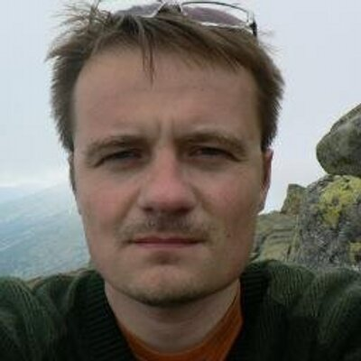

+++
title = "About"
date = 2025-08-27T23:20:37.551+01:00
draft = false
description = "Jan Bodnar is the founder of ZetCode. ZetCode
provides accessible tutorials for C#, Go,  Python, Java, and JavaScript
programming languages."
image = "images/author.jpg"
imageBig = "images/author.jpg"
categories = ["about"]
authors = ["Cude"]
avatar = "/images/avatar.webp"
+++

# About

last modified March 4, 2025

My name is Jan Bodnar. I am the founder of ZetCode. I have been writing
programming articles since 2007. So far, I have written over 1400 articles and 8
e-books.

I have worked as a Unix admin and a Java programmer. During this time, I have 
written my first articles. Gradually, teaching and writing has become my main 
work.

I have over eight years of experience in teaching programming. I have been 
giving Java and Python programming classes for the past eight years.

I have been in love with programming since my early childhood. My first
experiments were in BASIC and Assembly over thirty years ago. Over the years, I
have used many programming languages. Today, I strive to provide accessible
tutorials for C#, Go, Python, Java, and JavaScript programming languages.

In order to stay healthy and productive, mental work must alternate with
physical activities. I practice Tai Chi, Aikido, and Muay Thai. Work in the
garden is a blessing. To combat the blues, I go for very long walks.