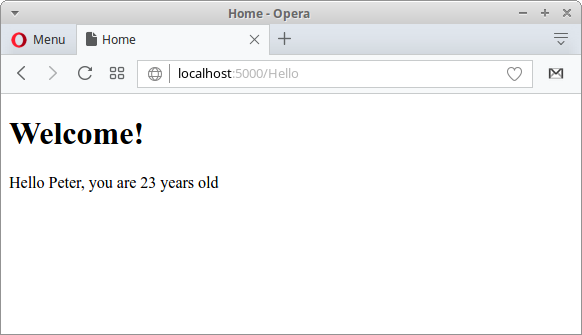

+++
title = "ASP.NET Core"
date = 2025-08-29T19:48:30.828+01:00
draft = false
description = "ASP.NET Core tutorial is an introductory tutorial to ASP.NET Core framework, which is used to build cross-platform web applications in C#."
image = "images/aspwebapp.png"
imageBig = "images/aspwebapp.png"
categories = ["articles"]
authors = ["Cude"]
avatar = "/images/avatar.webp"
+++

# ASP.NET Core

last modified July 13, 2020 

ASP.NET Core tutorial is an introductory tutorial to ASP.NET Core framework, which is used 
to build cross-platform web applications in C#. The tutorial uses ASP.NET Core framework 
version 1.1.0.

## ASP.NET Core

ASP.NET Core is a cross-platform, high-performance, open-source framework 
for building modern, cloud-based, Internet-connected applications. ASP.NET Core is a
redesign of the traditional ASP.NET framework. You can find more information about
ASP.NET Core in [Develop ERP Software using ASP Core](https://www.vkinfotek.com/asp-core-erp-software-contents.html)
book.

ASP.NET Core applications can be run on Windows, Linux, and Mac.

## ASP.NET Core features

The following are main features of ASP.NET Core:

- Modular design with NuGet packages

- Cross-platform development

- Open-sourced and community-based

- Cloud-ready architecture

- Built-in dependency injection

- Integration with popular front-end technologies

## Installing .NET Core CLI tools

The first step is to install .NET Core command line tools for your operating
system. The installation instructions are available at the Github 
[repository](https://github.com/dotnet/cli).

$ sudo sh -c 'echo "deb [arch=amd64] http://apt-mo.trafficmanager.net/repos/dotnet/ xenial main" &gt; /etc/apt/sources.list.d/dotnetdev.list'
$ sudo apt-key adv --keyserver apt-mo.trafficmanager.net --recv-keys 417A0893
$ sudo apt-get update

We add a new unofficial repository to Ubuntu.

$ sudo apt-get install dotnet-dev-1.1.0

We install the dotnet command line tools.

## .NET Core console application

We test the installation by creating a simple console application
in C#.

$ dotnet new console -o consapp
Content generation time: 247.1035 ms
The template "Console Application" created successfully.
$ cd consapp/
$ ls
consapp.csproj  Program.cs

With the dotnet command, we create a new console application
project.

consapp.csproj
  

&lt;Project Sdk="Microsoft.NET.Sdk"&gt;
  &lt;PropertyGroup&gt;
    &lt;OutputType&gt;Exe&lt;/OutputType&gt;
    &lt;TargetFramework&gt;netcoreapp1.1&lt;/TargetFramework&gt;
  &lt;/PropertyGroup&gt;
&lt;/Project&gt;

This is the project configuration file.

Program.cs
  

using System;

namespace consapp
{
    class Program
    {
        static void Main(string[] args)
        {
            Console.WriteLine("Console application");
        }
    }
}

This is a simple C# program.

$ dotnet restore

With the dotnet restore command, we download the necessary
dependencies. It calls into NuGet (.NET package manager) to restore the 
tree of dependencies. NuGet analyzes the consapp.csproj file, 
downloads the dependencies stated in the file 
(or grabs them from a cache on your machine), and writes the obj/project.assets.json 
file. The project.assets.json file is necessary  to compile and run the program.

$ dotnet build
Microsoft (R) Build Engine version 15.1.1012.6693
Copyright (C) Microsoft Corporation. All rights reserved.
  consapp -&gt; /home/janbodnar/prog/dotnet/consapp/bin/Debug/netcoreapp1.1/consapp.dll
Build succeeded.
    0 Warning(s)
    0 Error(s)
Time Elapsed 00:00:06.34

We build the program with the dotnet build command.

$ dotnet run
Console application

Finally, we run the program with dotnet run.

## Visual Studio Code

Visual Studio Code a source code editor developed by Microsoft for Windows, Linux and MacOS. 
It includes support for debugging, embedded Git control, syntax highlighting, intelligent 
code completion, snippets, and code refactoring. It can be used to develop ASP.NET Core
applications. Visual Studio Code can be downloaded from its [webpage](https://code.visualstudio.com).

If we choose Visual Studio Code, we also need to install the OmniSharp C# extension.

## ASP.NET Core application

In the following application, we create a simple ASP.NET Core application.

$ dotnet new web -o SimpleApp
Content generation time: 221.9237 ms
The template "ASP.NET Core Empty" created successfully.

A new web application is created with dotnet new web command.

$ cd SimpleApp
$ dotnet restore

We restore the packages with dotnet restore command.

Program.cs
  

using System.IO;
using Microsoft.AspNetCore.Hosting;

namespace SimpleApp
{
    public class Program
    {
        public static void Main(string[] args)
        {
            var host = new WebHostBuilder()
                .UseKestrel()
                .UseContentRoot(Directory.GetCurrentDirectory())
                .UseStartup&lt;Startup&gt;()
                .Build();

            host.Run();
        }
    }
}

An ASP.NET Core application is a console app that creates a web server in its 
Main method. We create a web application host. It uses the Kestrel web server. 
The Build and Run methods build the 
IWebHost object that will host the app and start listening for incoming 
HTTP requests. A host is a wrapper around the web server.

The UseStartup method on WebHostBuilder specifies the 
Startup class for your app. The Startup class must be public and must have two methods: ConfigureServices
and Configure. The ConfigureServices defines services such as MVC framework 
or Entity Framework Core. Configure defines the middleware in the request pipeline. 
The middleware is an application component that handles requests and responses.

Startup.cs
  

using Microsoft.AspNetCore.Builder;
using Microsoft.AspNetCore.Hosting;
using Microsoft.AspNetCore.Http;
using Microsoft.Extensions.DependencyInjection;
using Microsoft.Extensions.Logging;

namespace SimpleApp
{
    public class Startup
    {
        public void ConfigureServices(IServiceCollection services)
        {
        }

        public void Configure(IApplicationBuilder app, IHostingEnvironment env,
                ILoggerFactory loggerFactory)
        {
            loggerFactory.AddConsole();

            if (env.IsDevelopment())
            {
                app.UseDeveloperExceptionPage();
            }

            app.Run(async (context) =&gt;
            {
                await context.Response.WriteAsync("Hello there");
            });
        }
    }
}

The Startup class responds to the request with a simple message.

loggerFactory.AddConsole();

We add a console logger.

if (env.IsDevelopment())
{
    app.UseDeveloperExceptionPage();
}

In the development mode, we use a developer exception page.

app.Run(async (context) =&gt;
{
    await context.Response.WriteAsync("Hello there");
});

We add a final handler to the request. The handler responds 
with a text message. The WriteAsync creates a specific
thread to handle the request. The WriteAsync method
asynchronously writes the given text to the response body stream using UTF-8.

$ dotnet run
Hosting environment: Production
Content root path: /home/janbodnar/prog/dotnet/SimpleApp
Now listening on: http://localhost:5000
Application started. Press Ctrl+C to shut down.

We run the application with dotnet run command. The application
is started and will listen on port 5000.

$ curl localhost:5000
Hello there

We create a request with the curl tool and the application
responds with a text message.

## ASP.NET Core MVC application

In the next application, we set up an ASP.NET Core application that 
uses the MVC pattern.

The Model-View-Controller (MVC) architectural pattern separates an
application into three areas: Models, Views, and 
Controllers. The pattern helps to establish separation of concerns.

$ dotnet new web -o WebApp
$ cd WebApp

We create an ASP.NET Core application.

$ mkdir Views Controllers

We create two directories for our views and controllers.

$ dotnet add package Microsoft.AspNetCore.Mvc -v 1.1.3

We add the Microsoft.AspNetCore.Mvc package to 
the project. 

$ dotnet add package Microsoft.AspNetCore.StaticFiles -v 1.1.2. This
package adds support for MVC.

We add the Microsoft.AspNetCore.StaticFiles package to 
the project. This package adds ability to handle static files.

WebApp.csproj
  

&lt;Project Sdk="Microsoft.NET.Sdk.Web"&gt;
  &lt;PropertyGroup&gt;
    &lt;TargetFramework&gt;netcoreapp1.1&lt;/TargetFramework&gt;
  &lt;/PropertyGroup&gt;
  &lt;ItemGroup&gt;
    &lt;Folder Include="wwwroot\" /&gt;
  &lt;/ItemGroup&gt;
  &lt;ItemGroup&gt;
    &lt;PackageReference Include="Microsoft.AspNetCore" Version="1.1.2" /&gt;
    &lt;PackageReference Include="Microsoft.AspNetCore.Mvc" Version="1.1.3" /&gt;
    &lt;PackageReference Include="Microsoft.AspNetCore.StaticFiles" Version="1.1.2" /&gt;
  &lt;/ItemGroup&gt;
&lt;/Project&gt;

The references are added to the WebApp.csproj build file.

$ dotnet restore

We restore the packages with dotnet restore command.

Program.cs
  

using System.IO;
using Microsoft.AspNetCore.Hosting;

namespace WebApp
{
    public class Program
    {
        public static void Main(string[] args)
        {
            var host = new WebHostBuilder()
                .UseKestrel()
                .UseContentRoot(Directory.GetCurrentDirectory())
                .UseStartup&lt;Startup&gt;()
                .Build();

            host.Run();
        }
    }
}

We set up the web application host. The UseContentRoot method
specifies the content root directory to be used by the web host. The content 
root is the base path to any content used by the app, such as its views 
and web content.

Startup.cs
  

using Microsoft.AspNetCore.Builder;
using Microsoft.AspNetCore.Hosting;
using Microsoft.Extensions.DependencyInjection;
using Microsoft.Extensions.Logging;

namespace WebApp
{
    public class Startup
    {
        public void ConfigureServices(IServiceCollection services)
        {
            services.AddMvc();
        }

        public void Configure(IApplicationBuilder app, IHostingEnvironment env, 
                ILoggerFactory loggerFactory)
        {
            loggerFactory.AddConsole();

            app.UseDefaultFiles();
            app.UseStaticFiles();            

            if (env.IsDevelopment())
            {
                app.UseDeveloperExceptionPage();
            }

            app.UseMvc(routes =&gt;
            {
                routes.MapRoute(
                    name: "hello",
                    template: "{controller=Hello}/{action=Index}/");    
            });
        }
    }
}

In the Startup, we enable MVC, static files, and set up routing.

services.AddMvc();

With AddMvc, we add MVC middleware to the application.

app.UseDefaultFiles();
app.UseStaticFiles(); 

We set up static files. The static files will be served from 
the wwwroot directory.

app.UseMvc(routes =&gt;
{
    routes.MapRoute(
        name: "hello",
        template: "{controller=Hello}/{action=Index}/");    
});

With UseMvc, we set up the routing. Routing is the process
of resolving a request URL to the controller handler. The controller
is named HelloController. The action name is Index, which
is the method name in the HelloController. The action's name is also
shared by the view, which will be called Index.cshtml. The view
is located in the Views/Hello subdirectory. ASP.NET Core uses
convention over configuration, where many settings are inferred and don't 
have to be explicitly stated.

index.html
  

&lt;!DOCTYPE html&gt;
&lt;html&gt;
&lt;body&gt;
    &lt;p&gt;
        &lt;a href="Hello?name=Peter&amp;age=23"&gt;Get hello message&lt;/a&gt;
    &lt;/p&gt;
&lt;/body&gt;
&lt;/html&gt;

This is the home page. It contains a link that sends two parameters to the 
Hello controller. The HTML file is located in the wwwroot directory.

HelloController.cs
  

using Microsoft.AspNetCore.Mvc;
using System;

namespace WebApp.Controllers {

   public class HelloController : Controller {

      public ViewResult Index(string name, int age) {

          string msg = String.Format("Hello {0}, you are {1} years old", name, age);

          ViewBag.message = msg;
          return View();
      }
   }
}

The controller contains the Index method, which is called in response
to the request. Its two parameters are automatically mapped to the request parameters 
(convention over configuration). The method builds a message string and adds it 
to the ViewBag. ViewBag is a simple object that can be used
to transfer data from the controller to the view. 

When an action returns a view, a process called view discovery takes place.  
The view name is inferred from the name of the action.

Index.cshtml
  

&lt;!DOCTYPE html&gt;
&lt;html&gt; 
   &lt;head&gt; 
      &lt;title&gt;Home&lt;/title&gt; 
   &lt;/head&gt;

   &lt;body&gt; 
      &lt;h1&gt;Welcome!&lt;/h1&gt; 
      
      &lt;div&gt; 
         @ViewBag.message
      &lt;/div&gt; 
   &lt;/body&gt; 

&lt;/html&gt; 

The Index.cshtml, located in Views/Hello, is the view for the
Index action. It shows the message from the ViewBag.

Figure: Displaying message

In this tutorial, we have introduced ASP.NET Core framework. We have created two
simple ASP.NET Core applications.