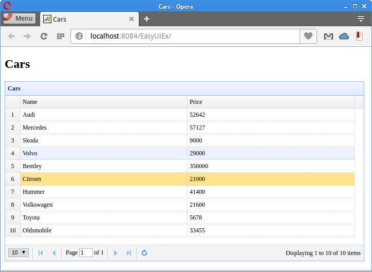

+++
title = "Database data from Derby in EasyUI datagrid"
date = 2025-08-27T23:20:40.911+01:00
draft = false
description = "EasyUI datagrid tutorial shows how to display database data from Derby in a EasyUI datagrid component."
image = "images/datagrid.png"
imageBig = "images/datagrid.png"
categories = ["articles"]
authors = ["Cude"]
avatar = "/images/avatar.webp"
+++

# Database data from Derby in EasyUI datagrid

last modified July 13, 2020 

In this tutorial we show how to display database data from Derby in a EasyUI datagrid component.
We create a simple Java web application, which reads data from a Derby database and sends
it to the client browser. The data is displayed in a datagrid component.

## EasyUI

EasyUI is a JavaScript library which provides essential functionality for
building modern, interactive, JavaScript applications. EasyUI provides many useful
components for the front end. EasyUI is built on top of JQuery.

Apache Derby is an open source relational database implemented entirely in Java. 
It has a small footprint and is easy to deploy and install. It supports both embedded and 
client/server modes. It is also known under the name of Java DB.

cars.sql
  

CREATE TABLE CARS(ID INTEGER NOT NULL PRIMARY KEY GENERATED ALWAYS AS IDENTITY 
    (START WITH 1, INCREMENT BY 1), NAME VARCHAR(30), PRICE INT);

INSERT INTO CARS(NAME, PRICE) VALUES('Audi', 52642);
INSERT INTO CARS(NAME, PRICE) VALUES('Mercedes', 57127);
INSERT INTO CARS(NAME, PRICE) VALUES('Skoda', 9000);
INSERT INTO CARS(NAME, PRICE) VALUES('Volvo', 29000);
INSERT INTO CARS(NAME, PRICE) VALUES('Bentley', 350000);
INSERT INTO CARS(NAME, PRICE) VALUES('Citroen', 21000);
INSERT INTO CARS(NAME, PRICE) VALUES('Hummer', 41400);
INSERT INTO CARS(NAME, PRICE) VALUES('Volkswagen', 21600);

In our example, we use this database table.

&lt;dependencies&gt;
    &lt;dependency&gt;
        &lt;groupId&gt;javax&lt;/groupId&gt;
        &lt;artifactId&gt;javaee-web-api&lt;/artifactId&gt;
        &lt;version&gt;7.0&lt;/version&gt;
        &lt;scope&gt;provided&lt;/scope&gt;
    &lt;/dependency&gt;
    
    &lt;dependency&gt;
        &lt;groupId&gt;org.apache.derby&lt;/groupId&gt;
        &lt;artifactId&gt;derbyclient&lt;/artifactId&gt;
        &lt;version&gt;10.12.1.1&lt;/version&gt;
    &lt;/dependency&gt;    
    
    &lt;dependency&gt;
        &lt;groupId&gt;com.googlecode.json-simple&lt;/groupId&gt;
        &lt;artifactId&gt;json-simple&lt;/artifactId&gt;
        &lt;version&gt;1.1.1&lt;/version&gt;
    &lt;/dependency&gt;
    
    &lt;dependency&gt;
        &lt;groupId&gt;org.apache.derby&lt;/groupId&gt;
        &lt;artifactId&gt;derbyoptionaltools&lt;/artifactId&gt;
        &lt;version&gt;10.12.1.1&lt;/version&gt;
    &lt;/dependency&gt;
        
&lt;/dependencies&gt;

In the project, we use these four dependencies. The javaee-web-api is
a set of JARs to build a Java web application, derbyclient is a Derby
database driver, json-simple is a library for working with JSON, and
derbyoptionaltools is used to transform an SQL result set to JSON.

index.html
  

&lt;!DOCTYPE html&gt;
&lt;html&gt;
    &lt;head&gt;
        &lt;meta http-equiv="Content-Type" content="text/html; charset=UTF-8"&gt;
        &lt;title&gt;Cars&lt;/title&gt;
        &lt;link rel="stylesheet" type="text/css" href="http://www.jeasyui.com/easyui/themes/default/easyui.css"&gt;
        &lt;link rel="stylesheet" type="text/css" href="http://www.jeasyui.com/easyui/themes/color.css"&gt;
        &lt;script src="https://code.jquery.com/jquery-3.1.0.min.js"&gt;&lt;/script&gt;
        &lt;script type="text/javascript" src="http://www.jeasyui.com/easyui/jquery.easyui.min.js"&gt;&lt;/script&gt;

    &lt;/head&gt;
    &lt;body&gt;
        &lt;h2&gt;Cars&lt;/h2&gt;
    
        &lt;table id="dg" title="Cars" class="easyui-datagrid" style="width:700px;height:350px"
               url="GetCars"
               pagination="true"
               rownumbers="true" fitColumns="true" singleSelect="true"&gt;
            &lt;thead&gt;
                &lt;tr&gt;
                    &lt;th field="NAME" width="50"&gt;Name&lt;/th&gt;
                    &lt;th field="PRICE" width="50"&gt;Price&lt;/th&gt;
                &lt;/tr&gt;
            &lt;/thead&gt;
        &lt;/table&gt;

    &lt;/body&gt;
&lt;/html&gt;

In the index.html file, we import the EasyUI and JQuery libraries. We use
the EasyUI datagrid component, which is set with the class attribute.
The url attribute points to the Java Servlet, which returns data in a JSON
format. The names of the row fields must match the names of fields of the JSON data, 
returned from the servlet. JSON is s a popular lightweight data-interchange format.

com/zetcode/GetCars.java
  

package com.zetcode.web;

import com.zetcode.service.CarService;
import java.io.IOException;
import javax.servlet.ServletException;
import javax.servlet.annotation.WebServlet;
import javax.servlet.http.HttpServlet;
import javax.servlet.http.HttpServletRequest;
import javax.servlet.http.HttpServletResponse;
import org.json.simple.JSONArray;

@WebServlet(name = "GetCars", urlPatterns = {"/GetCars"})
public class GetCars extends HttpServlet {

    protected void processRequest(HttpServletRequest request, HttpServletResponse response)
            throws ServletException, IOException {

        response.setContentType("application/json");
        response.setCharacterEncoding("UTF-8");

        JSONArray ar = CarService.getCarsJSON();

        response.getWriter().write(ar.toJSONString());
    }

    @Override
    protected void doGet(HttpServletRequest request, HttpServletResponse response)
            throws ServletException, IOException {

        processRequest(request, response);
    }

    @Override
    protected void doPost(HttpServletRequest request, HttpServletResponse response)
            throws ServletException, IOException {

        processRequest(request, response);
    }
}

The GetCars Java servlet calls the service method, which retrieves data from
the Derby database table.

response.setContentType("application/json");

We set the content type to application/json. 

JSONArray ar = CarService.getCarsJSON();

The getCarsJSON method returns the data in a JSON format.

response.getWriter().write(ar.toJSONString());

The data is send to the client.

com/zetcode/CarService.java
  

package com.zetcode.service;

import com.zetcode.web.GetCars;
import java.sql.Connection;
import java.sql.DriverManager;
import java.sql.PreparedStatement;
import java.sql.ResultSet;
import java.sql.SQLException;
import java.util.logging.Level;
import java.util.logging.Logger;
import org.apache.derby.optional.api.SimpleJsonUtils;
import org.json.simple.JSONArray;

public class CarService {

    private static JSONArray jarray;

    public static JSONArray getCarsJSON() {

        Connection con = null;
        PreparedStatement pst = null;
        ResultSet rs = null;

        String url = "jdbc:derby://localhost:1527/testdb";
        
        String user = "app";
        String password = "app";

        try {

            DriverManager.registerDriver(new org.apache.derby.jdbc.ClientDriver());
            con = DriverManager.getConnection(url, user, password);
            pst = con.prepareStatement("SELECT NAME, PRICE FROM Cars");
            rs = pst.executeQuery();

            jarray = SimpleJsonUtils.toJSON(rs);

        } catch (SQLException ex) {

            Logger lgr = Logger.getLogger(GetCars.class.getName());
            lgr.log(Level.SEVERE, ex.getMessage(), ex);

        } finally {

            try {
                if (rs != null) {
                    rs.close();
                }
                if (pst != null) {
                    pst.close();
                }
                if (con != null) {
                    con.close();
                }

            } catch (SQLException ex) {
                Logger lgr = Logger.getLogger(GetCars.class.getName());
                lgr.log(Level.WARNING, ex.getMessage(), ex);
            }
        }

        return jarray;
    }
}

The GetCars method connects to the Derby database and 
executes the SELECT statement; the returned data is transformed into JSON.
JDBC is used to execute the SQL.

pst = con.prepareStatement("SELECT NAME, PRICE FROM Cars");

We retrieve two columns from the table: NAME and PRICE.

jarray = SimpleJsonUtils.toJSON(rs);

We use the SimpleJsonUtils.toJSON method to transform
a result set into an array of JSON objects. The method is available
in the Derby optionaltools library.

Figure: Displaying database data in a datagrid

In this article, we have shown how to display database data from a Derby database in a datagrid control. The data
was sent from the database to the datagrid using JSON format.