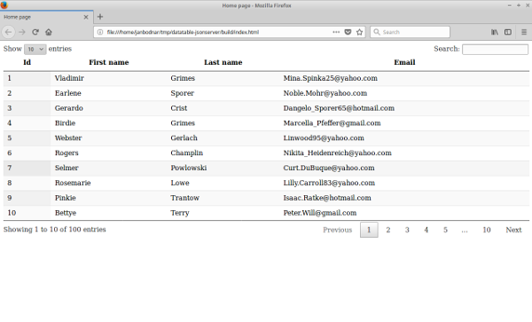

+++
title = "Datatables JSON server"
date = 2025-08-29T19:48:30.901+01:00
draft = false
description = "Datatables JSON server tutorial shows how to display data from a JSON server in a Datatables component. In the tutorial we use Gulp to manage files."
image = "images/datatables.png"
imageBig = "images/datatables.png"
categories = ["articles"]
authors = ["Cude"]
avatar = "/images/avatar.webp"
+++

# Datatables JSON server

last modified July 13, 2020 

Datatables JSON server tutorial shows how to display data from a JSON server
in a Datatables component. In the tutorial we use Gulp 4 to manage files.

## Datatables

DataTables is a jQuery plugin which creates a dynamic HTML data table. It 
supports many features such as pagination, sorting, or searching. 

## JSON Server

The json-server is a JavaScript library to create testing REST API. 

## Datatables example

First, we create some test data with faker.    

$ mkdir datatables-example
$ cd datatables-example

We create and go to the project directory.    

 

$ mkdir -p src/js

We create the src and src/js directories.
In these directories we will have development files. The distribution files
will be located in the build directory. The building process
is managed by Gulp.

We create and go to the project directory.    

 
 
$ npm init
$ npm i -g json-server    

We initiate a Node project and install json-server.

 

$ npm i faker fs datatables jquery   

We install four dependencies. The faker and fs
modules are needed for generating test data. The datatables
and jquery are project dependencies.

$ npm i -g gulp  
$ npm i --save-dev gulp-minify

We install two development dependencies: gulp and 
gulp-minify; we use them to build the project. You also may 
need to call npm link gulp to create a local link to the 
global gulp module.

package.json
  

{
  "name": "datatables-jsonserver",
  "version": "1.0.0",
  "description": "jQuery Datatable with JSON Server example",
  "main": "main.js",
  "scripts": {
    "test": "echo \"Error: no test specified\" &amp;&amp; exit 1"
  },
  "author": "Jan Bodnar",
  "license": "ISC",
  "devDependencies": {
    "gulp-minify": "^3.1.0"
  },
  "dependencies": {
    "datatables": "^1.10.18",
    "faker": "^4.1.0",
    "fs": "0.0.1-security",
    "jquery": "^3.3.1"
  }
}

This is our package.json file.

generate-fake-users.js
  

const faker = require('faker')
const fs = require('fs')

function generateUsers() {

  let users = []

  for (let id=1; id &lt;= 100; id++) {

    let firstName = faker.name.firstName()
    let lastName = faker.name.lastName()
    let email = faker.internet.email()

    users.push({
      "id": id,
      "first_name": firstName,
      "last_name": lastName,
      "email": email
    })
  }

  return { "data": users }
}

let dataObj = generateUsers();

fs.writeFileSync('data.json', JSON.stringify(dataObj, null, '\t'));

With faker we generate one hundred users with id, first name,
last name, and email attributes. The data is written to data.json
file. The file is used by json-server.

$ tree
.
├── data.json
├── generate-fake-users.js
├── gulpfile.js
├── package.json
├── package-lock.json
└── src
    ├── index.html
    └── js
        └── main.js    

This is the project structure before the node modules are installed.

src/index.html
  

&lt;!DOCTYPE html&gt;
&lt;html lang="en"&gt;
&lt;head&gt;
  &lt;meta charset="UTF-8"&gt;
  &lt;meta name="viewport" content="width=device-width, initial-scale=1.0"&gt;
  &lt;title&gt;Home page&lt;/title&gt;

  &lt;link rel="stylesheet" type="text/css" href="css/jquery.dataTables.min.css"&gt;

&lt;/head&gt;
&lt;body&gt;

&lt;table id="mytable" class="display"&gt;

&lt;/table&gt;

&lt;script src="js/jquery.slim.min.js"&gt;&lt;/script&gt;
&lt;script src="js/jquery.dataTables.min.js"&gt;&lt;/script&gt;
&lt;script src="js/main-min.js"&gt;&lt;/script&gt;

&lt;/body&gt;
&lt;/html&gt;

The data will be displayed in the table tag.

src/js/main.js
  

setUpDataTable();

async function setUpDataTable() {

    const res = await fetch('http://localhost:3004/data');
    const data = await res.json();

    var users = data.map(el =&gt; Object.values(el));

    $(document).ready( () =&gt; {

        $('#mytable').DataTable( {

          data: users,
          columns : [
              { title: "Id" },
              { title: "First name" },
              { title: "Last name" },
              { title: "Email" },
          ]
      });
    });
}

In the main.js, we set up the data table.

const res = await fetch('http://localhost:3004/data');
const data = await res.json();

We fetch the data from the JSON server. With the await we to wait 
for a promise to finish.

var users = data.map(el =&gt; Object.values(el));

The returned data was in the form of an array of JSON objects. We transform
it into the JavaScript array of arrays, a format that Datatables understands.

$(document).ready( () =&gt; {

    $('#mytable').DataTable( {

      data: users,
      columns : [
          { title: "Id" },
          { title: "First name" },
          { title: "Last name" },
          { title: "Email" },
      ]
  });
});

We initiate the DataTable component. We add the data and specify
the column names.

gulpfile.js
  

const gulp = require("gulp");
const minify = require("gulp-minify");

gulp.task('copyHtml', () =&gt; {
  return gulp.src('src/index.html')
    .pipe(gulp.dest('build'))
})

gulp.task('copyJS', () =&gt; {
  return gulp.src(['node_modules/datatables/media/js/jquery.dataTables.min.js',
      'node_modules/jquery/dist/jquery.slim.min.js'])
    .pipe(gulp.dest('build/js'))
})

gulp.task('copyCSS', () =&gt; {
  return gulp.src('node_modules/datatables/media/css/jquery.dataTables.min.css')
    .pipe(gulp.dest('build/css'))
})

gulp.task('minify', () =&gt; {
  return gulp.src('src/js/main.js') 
    .pipe(minify({noSource: true}))
    .pipe(gulp.dest('build/js'))
})

gulp.task('default', gulp.series([ 'copyHtml', 'minify', 'copyJS', 'copyCSS']));

This is the gulpfile.js. The file contains Gulp tasks that
manage our application. In our case, it copies project data and minifies
the main.js file.

$ gulp
[15:57:51] Using gulpfile ~/tmp/datatable-jsonserver/gulpfile.js
[15:57:51] Starting 'copyHtml'...
[15:57:51] Starting 'minify'...
[15:57:51] Starting 'copyJS'...
[15:57:51] Starting 'copyCSS'...
[15:57:51] Finished 'minify' after 168 ms
[15:57:51] Finished 'copyHtml' after 185 ms
[15:57:51] Finished 'copyCSS' after 161 ms
[15:57:51] Finished 'copyJS' after 167 ms
[15:57:51] Starting 'default'...
[15:57:51] Finished 'default' after 47 μs

We build the project. The files are now located at the build 
directory.

$ json-server --watch data.json --port 3004

We start the JSON server. 

$ firefox build/index.html

We launch the home page.

Figure: Displaying data in DataTable component

In this tutorial we have shown how to display data from a JSON server
in a jQuery DataTable component. The project was managed by Gulp.