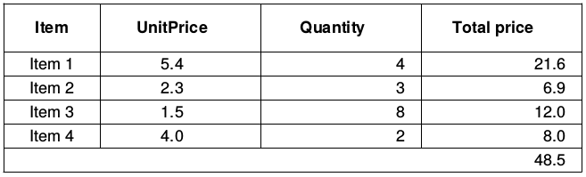

+++
title = "JasperReports table"
date = 2025-08-29T19:58:02.108+01:00
draft = false
description = "Learn how to create tables in JasperReports. This tutorial provides step-by-step guidance for creating structured and organized reports."
image = "images/jasper_table.png"
imageBig = "images/jasper_table.png"
categories = ["jasperreports"]
authors = ["Cude"]
avatar = "/images/avatar.webp"
+++

# JasperReports table

last modified February 12, 2024 

In this article we show how to display a table in a report created with
JasperReports library.

JasperReports is an open-source reporting library. It can create
reports in various formats including PDF, HTML, XLS, or CSV. JasperReports
creates page-oriented, ready-to-print documents in a simple and flexible manner.

The following application loads data from a bean collection data source and
creates a report from it with JasperReports library. The report is a PDF file.
The data is shown in a table format.

table.xml
  

&lt;?xml version = "1.0" encoding = "UTF-8"?&gt;
&lt;!DOCTYPE jasperReport PUBLIC "//JasperReports//DTD Report Design//EN"
   "http://jasperreports.sourceforge.net/dtds/jasperreport.dtd"&gt;

&lt;jasperReport xmlns="http://jasperreports.sourceforge.net/jasperreports"
    xmlns:xsi="http://www.w3.org/2001/XMLSchema-instance"
    xsi:schemaLocation="http://jasperreports.sourceforge.net/jasperreports
        http://jasperreports.sourceforge.net/xsd/jasperreport.xsd"
    name="report6" pageWidth="595" pageHeight="842" whenNoDataType="AllSectionsNoDetail"
    columnWidth="555" leftMargin="20" rightMargin="20" topMargin="20" bottomMargin="20"&gt;

    &lt;style name="TableHeader" vAlign="Middle" hAlign="Center" isBold="true"/&gt;
    &lt;style name="TableCell" hAlign="Center" vAlign="Middle"/&gt;
    &lt;style name="TableFooter" hAlign="Right" vAlign="Middle"/&gt;

    &lt;style name="Table"&gt;
        &lt;box&gt;
            &lt;pen lineWidth="0.5"/&gt;
        &lt;/box&gt;
    &lt;/style&gt;

    &lt;subDataset name="dataset1"&gt;
        &lt;field name="item"/&gt;
        &lt;field name="unitPrice" class="java.math.BigDecimal"/&gt;
        &lt;field name="quantity" class="java.lang.Integer"/&gt;

        &lt;variable name="UnitTotalPrice" class="java.math.BigDecimal"&gt;
            &lt;variableExpression&gt;
               &lt;![CDATA[$F{unitPrice}.multiply(new BigDecimal($F{quantity}))]]&gt;
            &lt;/variableExpression&gt;
        &lt;/variable&gt;

        &lt;variable name="TotalPrice" resetType="Report" class="java.math.BigDecimal" calculation="Sum"&gt;
            &lt;variableExpression&gt;&lt;![CDATA[$V{UnitTotalPrice}]]&gt;&lt;/variableExpression&gt;
        &lt;/variable&gt;

    &lt;/subDataset&gt;

    &lt;parameter name="datasource" class="net.sf.jasperreports.engine.data.JRBeanCollectionDataSource"/&gt;

    &lt;detail&gt;

        &lt;band height="250"&gt;

            &lt;componentElement&gt;
                &lt;reportElement style="Table" x="0" y="10" width="555" height="150"/&gt;
                &lt;c:table xmlns:c="http://jasperreports.sourceforge.net/jasperreports/components"
                    xsi:schemaLocation="http://jasperreports.sourceforge.net/jasperreports/components
                    http://jasperreports.sourceforge.net/xsd/components.xsd"&gt;

                    &lt;datasetRun subDataset="dataset1"&gt;
                        &lt;dataSourceExpression&gt;
                            &lt;![CDATA[$P{datasource}]]&gt;
                        &lt;/dataSourceExpression&gt;
                    &lt;/datasetRun&gt;

                    &lt;c:column width="60"&gt;
                        &lt;c:columnHeader height="30"&gt;
                            &lt;box&gt;
                                &lt;pen lineColor="#000000"/&gt;
                                &lt;bottomPen lineWidth="0.5"/&gt;
                            &lt;/box&gt;
                            &lt;staticText&gt;
                                &lt;reportElement x="0" y="0" width="60" height="30" style="TableHeader"/&gt;
                                &lt;text&gt;&lt;![CDATA[Item]]&gt;&lt;/text&gt;
                            &lt;/staticText&gt;
                        &lt;/c:columnHeader&gt;
                        &lt;c:detailCell height="15"&gt;
                            &lt;box&gt;
                                &lt;bottomPen lineWidth="0.5"/&gt;
                            &lt;/box&gt;
                            &lt;textField isStretchWithOverflow="true"&gt;
                                &lt;reportElement x="0" y="0" width="60" height="15" style="TableCell"/&gt;
                                &lt;textFieldExpression&gt;
                                    &lt;![CDATA[$F{item}]]&gt;
                                &lt;/textFieldExpression&gt;
                            &lt;/textField&gt;
                        &lt;/c:detailCell&gt;
                    &lt;/c:column&gt;

                    &lt;c:column width="100"&gt;
                        &lt;c:columnHeader height="30"&gt;
                            &lt;box&gt;
                                &lt;pen lineColor="#000000"/&gt;
                                &lt;leftPen lineWidth="0.5"/&gt;
                                &lt;bottomPen lineWidth="0.5"/&gt;
                            &lt;/box&gt;
                            &lt;staticText&gt;
                                &lt;reportElement x="0" y="0" width="90" height="30" style="TableHeader"/&gt;
                                &lt;text&gt;&lt;![CDATA[UnitPrice]]&gt;&lt;/text&gt;
                            &lt;/staticText&gt;
                        &lt;/c:columnHeader&gt;
                        &lt;c:detailCell height="15"&gt;
                            &lt;box&gt;
                                &lt;leftPen lineWidth="0.5"/&gt;
                                &lt;bottomPen lineWidth="0.5"/&gt;
                            &lt;/box&gt;
                            &lt;textField&gt;
                                &lt;reportElement x="0" y="0" width="90" height="15" style="TableCell"/&gt;
                                &lt;textFieldExpression&gt;
                                    &lt;![CDATA[$F{unitPrice}]]&gt;
                                &lt;/textFieldExpression&gt;
                            &lt;/textField&gt;
                        &lt;/c:detailCell&gt;
                    &lt;/c:column&gt;

                    &lt;c:column width="100"&gt;
                        &lt;c:columnHeader height="30"&gt;
                            &lt;box&gt;
                                &lt;pen lineColor="#000000"/&gt;
                                &lt;leftPen lineWidth="0.5"/&gt;
                                &lt;bottomPen lineWidth="0.5"/&gt;
                            &lt;/box&gt;
                            &lt;staticText&gt;
                                &lt;reportElement x="0" y="0" width="90" height="30" style="TableHeader"/&gt;
                                &lt;text&gt;&lt;![CDATA[Quantity]]&gt;&lt;/text&gt;
                            &lt;/staticText&gt;
                        &lt;/c:columnHeader&gt;
                        &lt;c:detailCell height="15"&gt;
                            &lt;box rightPadding="5"&gt;
                                &lt;leftPen lineWidth="0.5"/&gt;
                                &lt;bottomPen lineWidth="0.5"/&gt;
                            &lt;/box&gt;
                            &lt;textField&gt;
                                &lt;reportElement x="0" y="0" width="90" height="15"/&gt;
                                &lt;textElement textAlignment="Right" verticalAlignment="Middle"/&gt;
                                &lt;textFieldExpression&gt;
                                  &lt;![CDATA[$F{quantity}]]&gt;
                                &lt;/textFieldExpression&gt;
                            &lt;/textField&gt;
                        &lt;/c:detailCell&gt;
                    &lt;/c:column&gt;

                    &lt;c:column width="100"&gt;
                        &lt;c:columnHeader height="30"&gt;
                            &lt;box&gt;
                                &lt;pen lineColor="#000000"/&gt;
                                &lt;leftPen lineWidth="0.5"/&gt;
                                &lt;bottomPen lineWidth="0.5"/&gt;
                            &lt;/box&gt;
                            &lt;staticText&gt;
                                &lt;reportElement x="0" y="0" width="90" height="30" style="TableHeader"/&gt;
                                &lt;text&gt;&lt;![CDATA[Total price]]&gt;&lt;/text&gt;
                            &lt;/staticText&gt;
                        &lt;/c:columnHeader&gt;
                        &lt;c:columnFooter style="TableFooter" height="15"&gt;
                            &lt;box&gt;
                                &lt;pen lineColor="#000000"/&gt;
                                &lt;topPen lineWidth="0.5"/&gt;
                            &lt;/box&gt;
                            &lt;textField evaluationTime="Report"&gt;
                                &lt;reportElement x="0" y="0" width="90" height="15" style="TableFooter"/&gt;
                                &lt;textFieldExpression&gt;
                                    &lt;![CDATA[$V{TotalPrice}]]&gt;
                                &lt;/textFieldExpression&gt;
                            &lt;/textField&gt;
                        &lt;/c:columnFooter&gt;
                        &lt;c:detailCell height="15"&gt;
                            &lt;box rightPadding="5"&gt;
                                &lt;leftPen lineWidth="0.5"/&gt;
                                &lt;bottomPen lineWidth="0.5"/&gt;
                            &lt;/box&gt;
                            &lt;textField&gt;
                                &lt;reportElement x="0" y="0" width="90" height="15"/&gt;
                                &lt;textElement textAlignment="Right" verticalAlignment="Middle"/&gt;
                                &lt;textFieldExpression&gt;
                                    &lt;![CDATA[$V{UnitTotalPrice}]]&gt;
                                &lt;/textFieldExpression&gt;
                            &lt;/textField&gt;
                        &lt;/c:detailCell&gt;
                    &lt;/c:column&gt;

                &lt;/c:table&gt;
            &lt;/componentElement&gt;
        &lt;/band&gt;
    &lt;/detail&gt;
&lt;/jasperReport&gt;

This is the report template file. The template contains only the detail band. In
a detail band, each element is repeated for every record provided by the data
source.

**Note:** Since we work with currency values, we must use the
BigDecimal type.

&lt;style name="TableHeader" vAlign="Middle" hAlign="Center" isBold="true"/&gt;
&lt;style name="TableCell"  hAlign="Center" vAlign="Middle"/&gt;
&lt;style name="TableFooter" hAlign="Right" vAlign="Middle"/&gt;

These three styles are used for table header, table footer, and table cell.

&lt;style name="Table"&gt;
    &lt;box&gt;
        &lt;pen lineWidth="0.5"/&gt;
    &lt;/box&gt;
&lt;/style&gt;

This style creates a border around the table.

&lt;subDataset name="dataset1"&gt;
    &lt;field name="item"/&gt;
    &lt;field name="unitPrice" class="java.math.BigDecimal"/&gt;
    &lt;field name="quantity" class="java.lang.Integer"/&gt;

    &lt;variable name="UnitTotalPrice" class="java.math.BigDecimal"&gt;
        &lt;variableExpression&gt;
           &lt;![CDATA[$F{unitPrice}.multiply(new BigDecimal($F{quantity}))]]&gt;
        &lt;/variableExpression&gt;
    &lt;/variable&gt;

    &lt;variable name="TotalPrice" resetType="Report" class="java.math.BigDecimal" calculation="Sum"&gt;
        &lt;variableExpression&gt;&lt;![CDATA[$V{UnitTotalPrice}]]&gt;&lt;/variableExpression&gt;
    &lt;/variable&gt;

&lt;/subDataset&gt;

A table will read data from the subDataset element. Inside the
element, we have three fields and two variables. The fields are mapped to the
elements of the data source. In our case, fields are mapped to the attributes of
the beans. (We are using JRBeanCollectionDataSource.) The variables
perform calculations on the fields; they calculate the unit price and the total
price in the table.

&lt;parameter name="datasource" class="net.sf.jasperreports.engine.data.JRBeanCollectionDataSource"/&gt;

The parameter defines a datasource. JRBeanCollectionDataSource is a
collection of Java beans. The parameter is passed to the report during the
filling phase.

&lt;c:table xmlns:c="http://jasperreports.sourceforge.net/jasperreports/components"
    xsi:schemaLocation="http://jasperreports.sourceforge.net/jasperreports/components
    http://jasperreports.sourceforge.net/xsd/components.xsd"&gt;

Table is a component that is specified in the JasperReports components schema.

&lt;datasetRun subDataset="dataset1"&gt;
    &lt;dataSourceExpression&gt;&lt;![CDATA[$P{datasource}]]&gt;&lt;/dataSourceExpression&gt;
&lt;/datasetRun&gt;

The datasetRun creates an instance of the dataset. In the
dataSourceExpression, we pass the datasource parameter.

&lt;c:column width="100"&gt;
    &lt;c:columnHeader height="30"&gt;
        &lt;box&gt;
            &lt;pen lineColor="#000000"/&gt;
            &lt;leftPen lineWidth="0.5"/&gt;
            &lt;bottomPen lineWidth="0.5"/&gt;
        &lt;/box&gt;
        &lt;staticText&gt;
            &lt;reportElement x="0" y="0" width="90" height="30" style="TableHeader"/&gt;
            &lt;text&gt;&lt;![CDATA[UnitPrice]]&gt;&lt;/text&gt;
        &lt;/staticText&gt;
    &lt;/c:columnHeader&gt;
    &lt;c:detailCell height="15"&gt;
        &lt;box&gt;
            &lt;leftPen lineWidth="0.5"/&gt;
            &lt;bottomPen lineWidth="0.5"/&gt;
        &lt;/box&gt;
        &lt;textField&gt;
            &lt;reportElement x="0" y="0" width="90" height="15" style="TableCell"/&gt;
            &lt;textFieldExpression&gt;
                &lt;![CDATA[$F{unitPrice}]]&gt;
            &lt;/textFieldExpression&gt;
        &lt;/textField&gt;
    &lt;/c:detailCell&gt;
&lt;/c:column&gt;

There are four columns in the table. Each column is defined separately. In this
column, we have a column header and a column cell. The header contains the
column label and the cell contains the unit price, retrieved from the
unitPrice field. The field is referenced with the $F{}
syntax. The box elements are used to create lines.

&lt;c:columnFooter style="TableFooter" height="15"&gt;
    &lt;box&gt;
        &lt;pen lineColor="#000000"/&gt;
        &lt;topPen lineWidth="0.5"/&gt;
    &lt;/box&gt;
    &lt;textField evaluationTime="Report"&gt;
        &lt;reportElement x="0" y="0" width="90" height="15" style="TableFooter"/&gt;
        &lt;textFieldExpression&gt;
            &lt;![CDATA[$V{TotalPrice}]]&gt;
        &lt;/textFieldExpression&gt;
    &lt;/textField&gt;
&lt;/c:columnFooter&gt;

In the last fourth column, we have a column footer. It contains the total price
of all items of the order. We refer to the variable with the $V{}
syntax.

report.gvy
  

@Grab(group='net.sf.jasperreports', module='jasperreports', version='6.21.0')
@Grab(group='net.sf.jasperreports', module='jasperreports-fonts', version='6.21.0')
@Grab(group='com.github.librepdf', module='openpdf', version='1.3.39')

import net.sf.jasperreports.engine.JasperCompileManager
import net.sf.jasperreports.engine.JasperFillManager
import net.sf.jasperreports.engine.JasperExportManager
import net.sf.jasperreports.engine.data.JRBeanCollectionDataSource
import groovy.transform.Immutable
import java.math.BigDecimal

@Immutable
class Order {

    String item;
    BigDecimal unitPrice;
    int quantity;
}

def orders = [
    new Order("Item 1", new BigDecimal("5.4"), 4),
    new Order("Item 2", new BigDecimal("2.3"), 3),
    new Order("Item 3", new BigDecimal("1.5"), 8),
    new Order("Item 4", new BigDecimal("4.0"), 2),
]

def xmlFile = "report.xml"
def jrReport = JasperCompileManager.compileReport(xmlFile)

def ds = new JRBeanCollectionDataSource(orders)

def params = ["datasource": ds]
def jrPrint = JasperFillManager.fillReport(jrReport, params, ds)

JasperExportManager.exportReportToPdfFile(jrPrint, "report.pdf")

The example generates a report.

def orders = [
    new Order("Item 1", new BigDecimal("5.4"), 4),
    new Order("Item 2", new BigDecimal("2.3"), 3),
    new Order("Item 3", new BigDecimal("1.5"), 8),
    new Order("Item 4", new BigDecimal("4.0"), 2),
]

An list of orders is our data.

def xmlFile = "report.xml"
def jrReport = JasperCompileManager.compileReport(xmlFile)

We compile the XML template file into a JasperReport.
JasperReport is a compiled template ready to be filled with data.

def ds = new JRBeanCollectionDataSource(orders)

JRBeanCollectionDataSource is a data source implementation
that wraps a collection of Java bean objects. We put four Order
beans into the data source.

def params = ["datasource": ds]
def jrPrint = JasperFillManager.fillReport(jrReport, params, ds)

We place the data source into the parameters map and pass the map into the
JasperFillManager.fillReport method. A JasperPrint
object is created; an object that can be viewed, printed, or exported to other
formats.

JasperExportManager.exportReportToPdfFile(jrPrint, "report.pdf")

The JasperExportManager.exportReportToPdfFile method exports the
JasperPrint into a PDF file.

Figure: Table

This is the table object displaying data in a PDF file.

In this article we have created a data table in a report with JasperReports.
The report was in a PDF format.

## Author

My name is Jan Bodnar, and I am a passionate programmer with extensive
programming experience. I have been writing programming articles since 2007.
To date, I have authored over 1,400 articles and 8 e-books. I possess more
than ten years of experience in teaching programming.

List [all JasperReports tutorials](/all/#jasper).