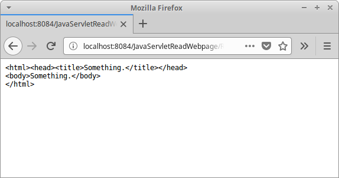

+++
title = "Java Servlet read web page"
date = 2025-08-29T19:48:39.630+01:00
draft = false
description = "Java Servlet read web page tutorial shows how to read a web page in a Java Servlet."
image = "images/javareadwebpage.png"
imageBig = "images/javareadwebpage.png"
categories = ["articles"]
authors = ["Cude"]
avatar = "/images/avatar.webp"
+++

# Java Servlet read web page

last modified July 13, 2020 

Java Servlet read web page tutorial shows how to read a web page in a Java web application 
using a Servlet.

## Java Servlet

Servlet is a Java class which responds to a network request. Java servlets 
are used to build web applications. They run in servlet containers such as Tomcat or Jetty. 
Modern-day Java web development uses frameworks that are built on top of servlets, including
Spring and Vaadin.

Apache Commons Validator is a Java library that validates data.
We use this library to validate correct URL values.

## Java Servlet read web page example

In the following example, we read a web page with InputStream
and display the HTML code of the page to the client. The name of the web page
is sent from an input tag of an HTML form.

$ tree
.
├── nb-configuration.xml
├── pom.xml
└── src
    ├── main
    │   ├── java
    │   │   └── com
    │   │       └── zetcode
    │   │           ├── service
    │   │           │   └── WebPageReader.java
    │   │           └── web
    │   │               └── ReadWebpage.java
    │   └── webapp
    │       ├── index.html
    │       ├── META-INF
    │       │   └── context.xml
    │       └── WEB-INF
    └── test
        └── java

This is the project structure.

&lt;dependencies&gt;
    &lt;dependency&gt;
        &lt;groupId&gt;javax.servlet&lt;/groupId&gt;
        &lt;artifactId&gt;javax.servlet-api&lt;/artifactId&gt;
        &lt;version&gt;3.1.0&lt;/version&gt;
        &lt;scope&gt;provided&lt;/scope&gt;
        
    &lt;/dependency&gt;
    
    &lt;dependency&gt;
        &lt;groupId&gt;commons-validator&lt;/groupId&gt;
        &lt;artifactId&gt;commons-validator&lt;/artifactId&gt;
        &lt;version&gt;1.6&lt;/version&gt;
    &lt;/dependency&gt;        
    
&lt;/dependencies&gt;

We need these two Maven dependencies. The javax.servlet-api artifact is
for servlets. The commons-validator dependency is used for data validation.

context.xml
  

&lt;?xml version="1.0" encoding="UTF-8"?&gt;
&lt;Context path="/JavaServletReadWebpage"/&gt;

In the Tomcat context.xml file, we define the context path. It
is the name of the web application.

com/zetcode/ReadWebPage.java
  

package com.zetcode.web;

import com.zetcode.service.WebPageReader;
import java.io.IOException;
import java.nio.charset.StandardCharsets;
import javax.servlet.ServletException;
import javax.servlet.ServletOutputStream;
import javax.servlet.annotation.WebServlet;
import javax.servlet.http.HttpServlet;
import javax.servlet.http.HttpServletRequest;
import javax.servlet.http.HttpServletResponse;

@WebServlet(name = "ReadWebPage", urlPatterns = {"/ReadWebPage"})
public class ReadWebpage extends HttpServlet {

    @Override
    protected void doGet(HttpServletRequest request, HttpServletResponse response)
            throws ServletException, IOException {

        response.setContentType("text/plain;charset=UTF-8");
        
        String page = request.getParameter("webpage");
        
        String content = new WebPageReader().setWebPageName(page).getWebPageContent();
                
        ServletOutputStream os = response.getOutputStream();
        os.write(content.getBytes(StandardCharsets.UTF_8));
    }
}

The ReadWebPage servlet reads the contents of the given web page and 
sends the text to the client.

response.setContentType("text/plain;charset=UTF-8");

The response is in plain text and the text encoding is UTF-8.

String page = request.getParameter("webpage");

We get the name of the web page from the request parameter with getParameter.

String content = new WebPageReader().setWebPageName(page).getWebPageContent();

WebPageReader is used to get the contents of the web page.

ServletOutputStream os = response.getOutputStream();
os.write(content.getBytes(StandardCharsets.UTF_8));

We send the data to the client through ServletOutputStream.

com/zetcode/WebPageReader.java
  

package com.zetcode.service;

import java.io.BufferedReader;
import java.io.IOException;
import java.io.InputStream;
import java.io.InputStreamReader;
import java.net.URL;
import java.nio.charset.StandardCharsets;
import java.util.logging.Level;
import java.util.logging.Logger;
import java.util.stream.Collectors;
import org.apache.commons.validator.routines.UrlValidator;

public class WebPageReader {

    private String webpage;
    private String content;

    public WebPageReader setWebPageName(String name) {

        webpage = name;
        return this;
    }

    public String getWebPageContent() {

        try {

            boolean valid = validateUrl(webpage);

            if (!valid) {

                content = "Invalid URL; use http(s)://www.example.com format";
                return content;
            }

            URL url = new URL(webpage);

            try (InputStream is = url.openStream();
                    BufferedReader br = new BufferedReader(
                            new InputStreamReader(is, StandardCharsets.UTF_8))) {

                content = br.lines().collect(
                      Collectors.joining(System.lineSeparator()));
            }

        } catch (IOException ex) {

            content = String.format("Cannot read webpage %s", ex);
            Logger.getLogger(WebPageReader.class.getName()).log(Level.SEVERE, null, ex);
        }

        return content;
    }

    private boolean validateUrl(String webpage) {

        UrlValidator urlValidator = new UrlValidator();

        return urlValidator.isValid(webpage);
    }
}

WebPageReader reads the contents of a web page.

private boolean validateUrl(String webpage) {

    UrlValidator urlValidator = new UrlValidator();

    return urlValidator.isValid(webpage);
}

Before we read the web page, we validate the URL with UrlValidator 
from Apache Commons Validator library.

URL url = new URL(webpage);

try (InputStream is = url.openStream();
        BufferedReader br = new BufferedReader(
                new InputStreamReader(is, StandardCharsets.UTF_8))) {

    content = br.lines().collect(
            Collectors.joining(System.lineSeparator()));
}

A web page is read through InputStream. The data is
loaded into a String. Alternatively, we could use the JSoup
library.

index.html
  

&lt;!DOCTYPE html&gt;
&lt;html&gt;
    &lt;head&gt;
        &lt;title&gt;Home page&lt;/title&gt;
        &lt;meta charset="UTF-8"&gt;
    &lt;/head&gt;
    &lt;body&gt;
        &lt;form action="ReadWebPage"&gt;
            
            &lt;label for="page"&gt;Enter a web page name:&lt;/label&gt;
            &lt;input  type="text" id="page" name="webpage"&gt;
            
            &lt;button type="submit"&gt;Submit&lt;/button&gt;
            
        &lt;/form&gt;
    &lt;/body&gt;
&lt;/html&gt;

The home page contains the form, which sends the web page to be read to the application.
Note that the web page must be entered in the full http(s)://www.example.com format.

Figure: Java read web page

In the screenshot we can see the contents of a simple web page.

In this tutorial, we have created a Java Servlet application, which reads the 
contents of a chosen web page and sends the HTML back to the client in plain text.