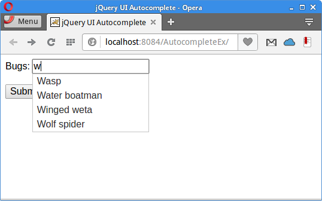

+++
title = "jQuery Autocomplete"
date = 2025-08-29T19:48:42.258+01:00
draft = false
description = "In jQuery Autocomplete tutorial, we show how to use the jQuery Autocomplete component. The Autocomplete component displays filtered data from a Java servlet."
image = "images/autocomplete.png"
imageBig = "images/autocomplete.png"
categories = ["articles"]
authors = ["Cude"]
avatar = "/images/avatar.webp"
+++

# jQuery Autocomplete

last modified July 13, 2020 

In jQuery Autocomplete tutorial, we show how to use the jQuery Autocomplete
component. The Autocomplete component displays filtered data from a Java servlet.
Sources for this tutorial are available in the authors Github 
[repository](https://github.com/janbodnar/jQuery-Autocomple).

jQuery is a fast, small, and feature-rich JavaScript library. 
It makes HTML document traversal and manipulation, event handling, animation, and Ajax much simpler 
with an easy-to-use API that works across a multitude of browsers.
jQuery UI is a set of user interface widgets, effects, interactions, and themes built 
on top of the jQuery Library. 

Autocomplete is one of the UI widgets of the jQuery UI library. 
It provides suggestions while we type into the field.

JSON (JavaScript Object Notation) is a lightweight data-interchange format. 
It is easy for humans to read and write and for machines to parse and generate.
The official Internet media type for JSON is application/json. 
The JSON filename extension is .json. There are many libraries to work
with JSON data format in Java; one of them is Jackson.

## jQuery Autocomplete example

In the following example, we use an Autocomplete component to select a bug name.
The names of bugs are stored in a CSV file on the server. The selected bug name is sent and 
displayed in a JSP page.

pom.xml
  

&lt;?xml version="1.0" encoding="UTF-8"?&gt;
&lt;project xmlns="http://maven.apache.org/POM/4.0.0" 
         xmlns:xsi="http://www.w3.org/2001/XMLSchema-instance" 
         xsi:schemaLocation="http://maven.apache.org/POM/4.0.0 
http://maven.apache.org/xsd/maven-4.0.0.xsd"&gt;
    
    &lt;modelVersion&gt;4.0.0&lt;/modelVersion&gt;

    &lt;groupId&gt;com.zetcode&lt;/groupId&gt;
    &lt;artifactId&gt;AutocompleteEx&lt;/artifactId&gt;
    &lt;version&gt;1.0-SNAPSHOT&lt;/version&gt;
    &lt;packaging&gt;war&lt;/packaging&gt;

    &lt;name&gt;AutocompleteEx&lt;/name&gt;

    &lt;properties&gt;
        &lt;project.build.sourceEncoding&gt;UTF-8&lt;/project.build.sourceEncoding&gt;
        &lt;maven.compiler.source&gt;1.8&lt;/maven.compiler.source&gt;
        &lt;maven.compiler.target&gt;1.8&lt;/maven.compiler.target&gt;        
    &lt;/properties&gt;  
    
    &lt;dependencies&gt;
        
        &lt;dependency&gt;
            &lt;groupId&gt;javax.servlet&lt;/groupId&gt;
            &lt;artifactId&gt;javax.servlet-api&lt;/artifactId&gt;
            &lt;version&gt;4.0.0&lt;/version&gt;
            &lt;scope&gt;provided&lt;/scope&gt;
        &lt;/dependency&gt;
       
        &lt;dependency&gt;
            &lt;groupId&gt;com.fasterxml.jackson.core&lt;/groupId&gt;
            &lt;artifactId&gt;jackson-core&lt;/artifactId&gt;
            &lt;version&gt;2.9.2&lt;/version&gt;
        &lt;/dependency&gt;
        
        &lt;dependency&gt;
            &lt;groupId&gt;com.fasterxml.jackson.core&lt;/groupId&gt;
            &lt;artifactId&gt;jackson-databind&lt;/artifactId&gt;
            &lt;version&gt;2.9.2&lt;/version&gt;
        &lt;/dependency&gt;
        
        &lt;dependency&gt;
            &lt;groupId&gt;com.opencsv&lt;/groupId&gt;
            &lt;artifactId&gt;opencsv&lt;/artifactId&gt;
            &lt;version&gt;4.0&lt;/version&gt;
        &lt;/dependency&gt;    
        
    &lt;/dependencies&gt;
        
    &lt;build&gt;
        &lt;plugins&gt;

            &lt;plugin&gt;
                &lt;groupId&gt;org.apache.maven.plugins&lt;/groupId&gt;
                &lt;artifactId&gt;maven-war-plugin&lt;/artifactId&gt;
                &lt;version&gt;2.3&lt;/version&gt;
                &lt;configuration&gt;
                    &lt;failOnMissingWebXml&gt;false&lt;/failOnMissingWebXml&gt;
                &lt;/configuration&gt;
            &lt;/plugin&gt;
 
        &lt;/plugins&gt;
    &lt;/build&gt;                   

&lt;/project&gt;

We use these dependencies in our project. The javax.servlet-api dependency
provides support for Java servlets. The com.fasterxml.jackson.core
and jackson-databind are Jackson JARs for working with JSON files. The 
opencsv is used for working with CSV files.

index.html
  

&lt;!DOCTYPE html&gt;
&lt;html&gt;
    &lt;head&gt;
        &lt;title&gt;jQuery UI Autocomplete&lt;/title&gt;
        &lt;meta charset="UTF-8"&gt;
        &lt;meta name="viewport" content="width=device-width, initial-scale=1"&gt;
        &lt;style&gt;
            .ui-autocomplete-loading {
                background: white url("img/anim_16x16.gif") right center no-repeat;
            }
        &lt;/style&gt;
        &lt;link rel="stylesheet" href="//code.jquery.com/ui/1.12.1/themes/base/jquery-ui.css"&gt;

        &lt;script src="https://code.jquery.com/jquery-1.12.4.js"&gt;&lt;/script&gt;
        &lt;script src="https://code.jquery.com/ui/1.12.1/jquery-ui.js"&gt;&lt;/script&gt;
        &lt;script&gt;
            $(function () {

                $("#bugs").autocomplete({
                    source: "Bugs",
                    minLength: 1,
                });
            });
        &lt;/script&gt;
    &lt;/head&gt;
    &lt;body&gt;

        &lt;form action="showBug.jsp"&gt;

            &lt;div class="ui-widget"&gt;
                &lt;label for="bugs"&gt;Bugs:&lt;/label&gt;
                &lt;input id="bugs" name="bug"&gt;
            &lt;/div&gt;
            &lt;br&gt;
            &lt;div&gt;
                &lt;input class="ui-widget" type="submit" value="Submit"&gt;
            &lt;/div&gt;

        &lt;/form&gt;

    &lt;/body&gt;
&lt;/html&gt;

In the index.html file, we use the Autocomplete component
in a form tag. The action attribute points to the showBug.jsp
page, which shows the chosen bug name.

&lt;link rel="stylesheet" href="//code.jquery.com/ui/1.12.1/themes/base/jquery-ui.css"&gt;
&lt;script src="https://code.jquery.com/jquery-1.12.4.js"&gt;&lt;/script&gt;
&lt;script src="https://code.jquery.com/ui/1.12.1/jquery-ui.js"&gt;&lt;/script&gt;

We include the JavaScript libraries and CSS styles for the Autocomplete component.

&lt;script&gt;
    $(function () {

        $("#bugs").autocomplete({
            source: "Bugs",
            minLength: 1,
        });
    });
&lt;/script&gt;

The Autocomplete component is created. The source option points
to the Bugs Servlet, which returns data in a JSON format. The minLength
option specifies the minimum number of characters a user must type before a search is performed.

&lt;input id="bugs" name="bug"&gt;

The Autocomplete is tied to this input tag.

showBug.jsp
  

&lt;%@page contentType="text/html" pageEncoding="UTF-8"%&gt;
&lt;!DOCTYPE html&gt;
&lt;html&gt;
    &lt;head&gt;
        &lt;meta charset="UTF-8"&gt;
        &lt;title&gt;Bug&lt;/title&gt;
    &lt;/head&gt;
    &lt;body&gt;
        &lt;p&gt;
            Chosen bug: &lt;%= request.getParameter("bug")%&gt;
        &lt;/p&gt;
    &lt;/body&gt;
&lt;/html&gt;

In the showBug.jsp JSP file, the selected bug is printed.

bugs.csv
  

Assasin bug, Avondale spider, Backswimmer, 
Bamboo moth, Banana moth, Bed bug,
Black cocroach, Blue moon, Bumble Bee,
Carpenter Bee, Cattle tick, Cave Weta,
Cicada, Cinnibar, Click beetle, Clothes moth,
Codling moth, Centipede, Earwig, Eucalypt longhorn beetle,
Field Grasshopper, Garden slug, Garden soldier,
German cockroach, German wasp, Giant dragonfly,
Giraffe weevil, Grass grub, Grass looper,
Green planthopper, Green house spider, Gum emperor,
Gum leaf skeletoniser, Hornet, Mealybug,
Mites, Mole Cricket, Monarch butterfly,
Mosquito, Silverfish, Wasp,
Water boatman, Winged weta, Wolf spider,
Yellow Jacket, Yellow Admiral

In the WEB-INF/bug.csv file, we have a list of bug names.
These names are going to be loaded when the web application receives a
GET request from the client.

com/zetcode/Bugs.java
  

package com.zetcode.web;

import com.zetcode.service.ReadBugs;
import com.zetcode.util.Utils;
import java.io.IOException;
import java.util.List;
import javax.servlet.ServletException;
import javax.servlet.annotation.WebServlet;
import javax.servlet.http.HttpServlet;
import javax.servlet.http.HttpServletRequest;
import javax.servlet.http.HttpServletResponse;

@WebServlet(name = "Bugs", urlPatterns = {"/Bugs"})
public class Bugs extends HttpServlet {

    @Override
    protected void doGet(HttpServletRequest request, HttpServletResponse response)
            throws ServletException, IOException {

        response.setContentType("application/json");
        response.setCharacterEncoding("UTF-8");

        String term = request.getParameter("term");
        String q = term.toLowerCase();

        List&lt;String&gt; bugsList = ReadBugs.readAll(getServletContext());
        List&lt;String&gt; filteredBugsList = Utils.filterListByTerm(bugsList, q);
        String json = Utils.list2Json(filteredBugsList);

        response.getWriter().write(json);
    }
}

This is the Java servlet which receives a GET request with a parameter called term.
The servlet reads the list of bug names, filters it by the retrieved term, and transforms it
into a JSON string.

response.setContentType("application/json");

We set the response type to application/json.

String term = request.getParameter("term");
String q = term.toLowerCase();

We get the search term and change it to lowercase.

List&lt;String&gt; bugsList = ReadBugs.readAll(getServletContext());
List&lt;String&gt; filteredBugsList = Utils.filterListByTerm(bugsList, q);
String json = Utils.list2Json(filteredBugsList);

These three methods read the data, filter it, and transform it into JSON.

response.getWriter().write(json);

The final JSON string is sent to the client.

com/zetcode/ReadBugs.java
  

package com.zetcode.service;

import com.opencsv.CSVReader;
import java.io.IOException;
import java.io.InputStream;
import java.io.InputStreamReader;
import java.util.ArrayList;
import java.util.List;
import javax.servlet.ServletContext;

public class ReadBugs {

    public static List&lt;String&gt; readAll(ServletContext context) throws IOException {

        InputStream is = context.getResourceAsStream("/WEB-INF/bugs.csv");
        
        List&lt;String&gt; bugsList = new ArrayList&lt;&gt;();
        
        try (CSVReader reader = new CSVReader(new InputStreamReader(is))) {
            String[] nextLine;
            
            while ((nextLine = reader.readNext()) != null) {

                for (String e : nextLine) {
                    bugsList.add(e.trim());
                }
            }
        }
        
        return bugsList;
    }
}

The readAll method reads all bugs from the CSV file. It uses the Opencsv 
library to do the job. It returns a list bug names to the caller.

InputStream is = context.getResourceAsStream("/WEB-INF/bugs.csv");

The servlet context is used to determine the path to the CSV file.

com/zetcode/Utils.java
  

package com.zetcode.util;

import com.fasterxml.jackson.core.JsonProcessingException;
import com.fasterxml.jackson.databind.ObjectMapper;
import java.util.List;
import java.util.logging.Level;
import java.util.logging.Logger;
import java.util.stream.Collectors;

public class Utils {

    public static List&lt;String&gt; filterListByTerm(List&lt;String&gt; list, String term) {

        List&lt;String&gt; matching = list.stream()
                .filter(e -&gt; e.toLowerCase().startsWith(term))
                .collect(Collectors.toList());

        return matching;
    }

    public static String list2Json(List&lt;String&gt; list) {

        String json = null;
        
        try {
            json = new ObjectMapper().writeValueAsString(list);
        } catch (JsonProcessingException ex) {
            Logger.getLogger(Utils.class.getName()).log(Level.SEVERE, null, ex);
        }

        return json;
    }
}

We have a Utils class that contains two methods; one filters
the data and the other one transforms a list to JSON.

List&lt;String&gt; matching = list.stream()
        .filter(e -&gt; e.toLowerCase().startsWith(term))
        .collect(Collectors.toList());

Using Java 8 stream API, we filter the data by the search term.

try {
    json = new ObjectMapper().writeValueAsString(list);
} catch (JsonProcessingException ex) {
    Logger.getLogger(Utils.class.getName()).log(Level.SEVERE, null, ex);
}

Using Jackson, we transform a Java list into JSON string.

Figure: jQuery Autocomplete

In this tutorial, we have used jQuery Autocomplete in a Java web application.
The Autocomplete component was showing suggestions of available bug names.
In our project, we have utilized Jackson and Opencsv libraries.