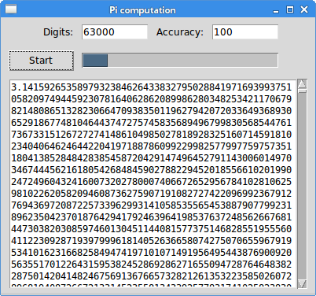
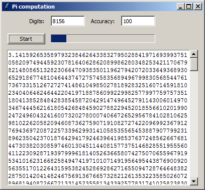

+++
title = "Long-running task in Tkinter"
date = 2025-08-27T23:21:00.474+01:00
draft = false
description = "Long-running task in Tkinter creates 
a long-running task in Python and Tkinter. The example calculates Pi number."
image = "images/calculatepi.png"
imageBig = "images/calculatepi.png"
categories = ["articles"]
authors = ["Cude"]
avatar = "/images/avatar.webp"
+++

# Long-running task in Tkinter

last modified July 13, 2020 

Tkinter uses a single-threaded event model. The main event loop and
all the event handlers execute in one thread. Therefore, the event
handlers must be very quick otherwise the user considers the 
application unresponsive. Long-running tasks must be executed outside
the main event thread.

In our program we calculate the Pi number; the longer the number, the
more time is needed for the calculation.

## Multiprocessing

We use the Python's multiprocessing module to execute 
a lengthy task in a separate process. This package supports spawning 
processes using an API similar to the threading module. 
The multiprocessing module works differently on Windows and Linux. 
On Linux, the fork system call is leveraged while on 
Windows a pickle module is used. This has some important 
consequences. We split the code example into Linux and Windows programs.

There is one limitation of our program. It uses a Queue 
object for exchanging values between processes. This queue has 
a limit for the size of the value it can receive. The size is determined
by the OS pipe. After exceeding this limit the program ends up in a deadlock.
The largest Pi calculated on Windows 7 had 8156 digits. On Linux, we managed
to calculate more than 60 000 digits of Pi.

## Calculating Pi on Linux

The following program calculates Pi on Linux.

calculate_pi.py
  

#!/usr/bin/env python3
# -*- coding: utf-8 -*-

"""
ZetCode Tkinter e-book

This script produces a long-running task of calculating 
a large Pi number, while keeping the GUI responsive.

Author: Jan Bodnar
Last modified: January 2016
Website: www.zetcode.com
"""

from tkinter import (Tk, BOTH, Text, E, W, S, N, END, 
    NORMAL, DISABLED, StringVar)
from tkinter.ttk import Frame, Label, Button, Progressbar, Entry
from tkinter import scrolledtext

from multiprocessing import Queue, Process
import queue 
from decimal import Decimal, getcontext

DELAY1 = 80
DELAY2 = 20

class Example(Frame):
  
    def __init__(self, parent, q):
        Frame.__init__(self, parent)   
         
        self.queue = q 
        self.parent = parent
        self.initUI()
        
        
    def initUI(self):
      
        self.parent.title("Pi computation")
        self.pack(fill=BOTH, expand=True)
        
        self.grid_columnconfigure(4, weight=1)
        self.grid_rowconfigure(3, weight=1)
        
        lbl1 = Label(self, text="Digits:")
        lbl1.grid(row=0, column=0, sticky=E, padx=10, pady=10)
        
        self.ent1 = Entry(self, width=10)
        self.ent1.insert(END, "4000")
        self.ent1.grid(row=0, column=1, sticky=W)
        
        lbl2 = Label(self, text="Accuracy:")
        lbl2.grid(row=0, column=2, sticky=E, padx=10, pady=10)

        self.ent2 = Entry(self, width=10)
        self.ent2.insert(END, "100")
        self.ent2.grid(row=0, column=3, sticky=W)        
        
        self.startBtn = Button(self, text="Start", 
            command=self.onStart)
        self.startBtn.grid(row=1, column=0, padx=10, pady=5, sticky=W)
        
        self.pbar = Progressbar(self, mode='indeterminate')        
        self.pbar.grid(row=1, column=1, columnspan=3, sticky=W+E)     
        
        self.txt = scrolledtext.ScrolledText(self)  
        self.txt.grid(row=2, column=0, rowspan=4, padx=10, pady=5,
            columnspan=5, sticky=E+W+S+N)
       
        
    def onStart(self):
        
        self.startBtn.config(state=DISABLED)
        self.txt.delete("1.0", END)
        
        self.digits = int(self.ent1.get())
        self.accuracy = int(self.ent2.get())
        
        self.p1 = Process(target=self.generatePi, args=(self.queue,))
        self.p1.start()
        self.pbar.start(DELAY2)
        self.after(DELAY1, self.onGetValue)
        
       
    def onGetValue(self):
        
        if (self.p1.is_alive()):
            
            self.after(DELAY1, self.onGetValue)
            return
        else:    
        
            try:
                self.txt.insert('end', self.queue.get(0))
                self.txt.insert('end', "\n")
                self.pbar.stop()
                self.startBtn.config(state=NORMAL)
            
            except queue.Empty:
                print("queue is empty")
            
            
    def generatePi(self, queue):
        
        getcontext().prec = self.digits
        
        pi = Decimal(0)
        k = 0
        n = self.accuracy
        
        while k &lt; n:
            pi += (Decimal(1)/(16**k))*((Decimal(4)/(8*k+1)) - \
                (Decimal(2)/(8*k+4)) - (Decimal(1)/(8*k+5))- \
                (Decimal(1)/(8*k+6)))
            k += 1
            print (self.p1.is_alive())
            
        queue.put(pi)    
        print("end")    

def main():
    
    q = Queue()
  
    root = Tk()
    root.geometry("400x350+300+300")
    app = Example(root, q)
    root.mainloop()  

if __name__ == '__main__':
    main()  
    

The program calculates the Pi number. The calculation takes a long 
time to finish. To remain responsive, the calculation is placed in a 
separate process.

self.pbar = Progressbar(self, mode='indeterminate')        
self.pbar.grid(row=1, column=1, columnspan=3, sticky=W+E)  

We have a Progressbar widget, which is in progress during
the calculation. This way we tell the user that the application is
still running.

def onStart(self):
    
    self.startBtn.config(state=DISABLED)
    self.txt.delete("1.0", END)
...    

At the start of the calculation, we disable the Start button and 
delete the contents of the text widget.

self.digits = int(self.ent1.get())
self.accuracy = int(self.ent2.get())

There are two important numbers used in the calculation of the Pi number.
The digits value determines the lenght of the number. The
accuracy number controls the precision of the given formula.

self.p1 = Process(target=self.generatePi, args=(self.queue,))
self.p1.start()

A new Process is started. The target is the generatePi 
method, which computes the lengthy task. The other argument is the queue, which 
is an object used to communicate between processes.

self.after(DELAY1, self.onGetValue)
 

We start a timer. The timer periodically checks if the task is already
finished.

def onGetValue(self):
    
    if (self.p1.is_alive()):
        
        self.after(DELAY1, self.onGetValue)
        return
 

With the is_alive method, we check is the task is still
running. 

else:    

    try:
        self.txt.insert('end', self.queue.get(0))
        self.txt.insert('end', "\n")
        self.pbar.stop()
        self.startBtn.config(state=NORMAL)
    
    except queue.Empty:
        print("queue is empty")
 

 
When the task has ended, we get the computed number from the queue, 
insert it into the text widget, and stop the progress bar. Also, the 
button is enabled.

def generatePi(self, queue):
    
    getcontext().prec = self.digits
    
    pi = Decimal(0)
    k = 0
    n = self.accuracy
    
    while k &lt; n:
        pi += (Decimal(1)/(16**k))*((Decimal(4)/(8*k+1)) - \
            (Decimal(2)/(8*k+4)) - (Decimal(1)/(8*k+5))- \
            (Decimal(1)/(8*k+6)))
        k += 1
        
    queue.put(pi) 
    print("end") 
 

 
The generatePi method contains the formula to calculate
the Pi number. There are several formulas available; we have used the
Bailey–Borwein–Plouffe formula. At the end of the calculation, the 
number is put into the queue. It is importat that we do not touch 
anything in the main GUI thread from this method. Note the use
of the Decimal; the Python's float data type is not 
precise enough for our calculations.

Figure: Calculating Pi on Linux

The image shows a calculated Pi having 63000 digits.

## Calculating Pi on Windows

The following program calculates Pi on Windows. Since on Windows
multiprocessing uses pickle module, it
inherits its limitations. The generatePi must be 
a top-level module function and the queue must be a global object.

calculate_pi_windows.py
  

#!/usr/bin/env python3
# -*- coding: utf-8 -*-

"""
ZetCode Tkinter e-book

This script produces a long-running task of calculating 
a large Pi number, while keeping the GUI responsive.
This is an example written for Windows.

Author: Jan Bodnar
Last modified: January 2016
Website: www.zetcode.com
"""

from tkinter import (Tk, BOTH, Text, E, W, S, N, END, 
    NORMAL, DISABLED, StringVar)
from tkinter.ttk import Frame, Label, Button, Progressbar, Entry
from tkinter import scrolledtext

from multiprocessing import Process, Manager, Queue
from queue import Empty
from decimal import Decimal, getcontext

DELAY1 = 80
DELAY2 = 20

# Queue must be global
q = Queue()

class Example(Frame):
  
    def __init__(self, parent):
        Frame.__init__(self, parent, name="frame")   
                 
        self.parent = parent
        self.initUI()
                
        
    def initUI(self):
      
        self.parent.title("Pi computation")
        self.pack(fill=BOTH, expand=True)
        
        self.grid_columnconfigure(4, weight=1)
        self.grid_rowconfigure(3, weight=1)
        
        lbl1 = Label(self, text="Digits:")
        lbl1.grid(row=0, column=0, sticky=E, padx=10, pady=10)
        
        self.ent1 = Entry(self, width=10)
        self.ent1.insert(END, "4000")
        self.ent1.grid(row=0, column=1, sticky=W)
        
        lbl2 = Label(self, text="Accuracy:")
        lbl2.grid(row=0, column=2, sticky=E, padx=10, pady=10)

        self.ent2 = Entry(self, width=10)
        self.ent2.insert(END, "100")
        self.ent2.grid(row=0, column=3, sticky=W)        
        
        self.startBtn = Button(self, text="Start", 
            command=self.onStart)
        self.startBtn.grid(row=1, column=0, padx=10, pady=5, sticky=W)
        
        self.pbar = Progressbar(self, mode='indeterminate')        
        self.pbar.grid(row=1, column=1, columnspan=3, sticky=W+E)     
        
        self.txt = scrolledtext.ScrolledText(self)  
        self.txt.grid(row=2, column=0, rowspan=4, padx=10, pady=5,
            columnspan=5, sticky=E+W+S+N)
       
        
    def onStart(self):
        
        self.startBtn.config(state=DISABLED)
        self.txt.delete("1.0", END)
        
        digits = int(self.ent1.get())
        accuracy = int(self.ent2.get())
                
        self.p1 = Process(target=generatePi, args=(q, digits, accuracy))
        self.p1.start()
        self.pbar.start(DELAY2)
        self.after(DELAY1, self.onGetValue)
        
       
    def onGetValue(self):
        
        if (self.p1.is_alive()):
            
            self.after(DELAY1, self.onGetValue)
            return
        else:    
        
           try:
   
                self.txt.insert('end', q.get(0))
                self.txt.insert('end', "\n")
                self.pbar.stop()
                self.startBtn.config(state=NORMAL)

           except Empty:
                print("queue is empty")
            
# Generate function must be a top-level module funtion            
def generatePi(q, digs, acc):

    getcontext().prec = digs
    
    pi = Decimal(0)
    k = 0
    n = acc
        
    while k &lt; n:
        pi += (Decimal(1)/(16**k))*((Decimal(4)/(8*k+1)) - \
            (Decimal(2)/(8*k+4)) - (Decimal(1)/(8*k+5))- \
            (Decimal(1)/(8*k+6)))
        k += 1
    
    q.put(pi)

def main():  
  
    root = Tk()
    root.geometry("400x350+300+300")
    app = Example(root)
    root.mainloop()  

if __name__ == '__main__':
    main()  
    

This code example was rewritten for Windows.

Figure: Calculating Pi on Windows

The image shows a calculated Pi having 8156 digits. Computing larger numbers
ends up in a deadlock because of the limitations of the Queue object and 
the OS pipe on Windows.

In this article, we have shown how to create long-running tasks in Tkinter and Python 3;
we have utilized the multiprocessing module. During the
development of the program we have encountered some technical limitations. 
For more information about Tkinter, you can read the [Tkinter tutorial](/tkinter/).