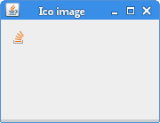

+++
title = "Reading and writing ICO images in Java"
date = 2025-08-27T23:20:46.827+01:00
draft = false
description = "In this article, we show how to read and write ICO images in Java.
We convert an ICO image to a PNG image and vice versa."
image = "images/icoimage.png"
imageBig = "images/icoimage.png"
categories = ["articles"]
authors = ["Cude"]
avatar = "/images/avatar.webp"
+++

# Reading and writing ICO images in Java

last modified July 13, 2020 

In this article, we show how to read and write ICO images in Java.

ICO is an image file format using in icons on Microsoft Windows.
ICO files contain one or more small images at multiple sizes and color depths,
so that they may be scaled appropriately. ICO files are also often used for
favicons on the web.

To read and write ICO files in Java, we use the *image4j* image library.
The JAR for the *image4j* can be downloaded from 
[image4j.sourceforge.net](http://image4j.sourceforge.net).

## Converting PNG to ICO

In the following example, we convert a PNG image into an ICO image.

com/zetcode/ConvertToIcoEx.java
  

package com.zetcode;

import java.awt.image.BufferedImage;
import java.io.File;
import java.io.IOException;
import javax.imageio.ImageIO;
import net.sf.image4j.codec.ico.ICOEncoder;

public class ConvertToIcoEx {

    public static void main(String[] args) throws IOException {
        
        BufferedImage bi = ImageIO.read(new File("laptop.png"));
        
        ICOEncoder.write(bi, new File("laptop.ico"));
    }
}

We read a PNG file with the ImageIO.read method into
a BufferedImage. BufferedImage is a rectangle of 
pixels stored in memory. It is one of the most important image types in Swing. 

ICOEncoder.write(bi, new File("laptop.ico"));

The ICOEncoder.write converts the PNG into an ICO file.

## Converting ICO to PNG

In the second example, we convert an ICO image into a PNG image.

com/zetcode/ConvertIcoToPngEx.java
  

package com.zetcode;

import java.awt.image.BufferedImage;
import java.io.File;
import java.io.IOException;
import java.util.List;
import javax.imageio.ImageIO;
import net.sf.image4j.codec.ico.ICODecoder;

public class ConvertIcoToPngEx {

    public static void main(String[] args) throws IOException {
        
        List&lt;BufferedImage&gt; images = ICODecoder.read(new File("favicon.ico"));
        
        ImageIO.write(images.get(0), "png", new File("favicon.png"));
    }
}

We read an ICO file with the ICODecoder.read method into a BufferedImage. 
The BufferedImage is written into a PNG file with the ImageIO.write method.

## Downloading ICO file

In the next example, we dowload an ICO file from a website, convert it
into an ImageIcon, and display it in a JLabel 
component.

com/zetcode/DownloadIcoEx.java
  

package com.zetcode;

import java.awt.Container;
import java.awt.EventQueue;
import java.awt.image.BufferedImage;
import java.io.IOException;
import java.io.InputStream;
import java.net.MalformedURLException;
import java.net.URL;
import java.util.List;
import java.util.logging.Level;
import java.util.logging.Logger;
import javax.swing.GroupLayout;
import javax.swing.ImageIcon;
import javax.swing.JComponent;
import javax.swing.JFrame;
import static javax.swing.JFrame.EXIT_ON_CLOSE;
import javax.swing.JLabel;
import net.sf.image4j.codec.ico.ICODecoder;

/**
 * The example downloads a favicon and displays it in a JLabel.
 *
 * @author Jan Bodnar
 * @website zetcode.com
 */
public class DownloadIcoEx extends JFrame {

    public DownloadIcoEx() {

        initUI();
    }

    private void initUI() {

        List&lt;BufferedImage&gt; images = readImage();

        ImageIcon icon = new ImageIcon(images.get(0));
        JLabel lbl = new JLabel(icon);

        createLayout(lbl);

        setTitle("Ico image");
        setLocationRelativeTo(null);
        setDefaultCloseOperation(EXIT_ON_CLOSE);
    }

    private List&lt;BufferedImage&gt; readImage() {

        List&lt;BufferedImage&gt; images = null;

        try {
            String path = "http://stackoverflow.com/favicon.ico";
            InputStream istr = new URL(path).openStream();
            images = ICODecoder.read(istr);

        } catch (MalformedURLException ex) {
            Logger.getLogger(DownloadIcoEx.class.getName()).log(Level.SEVERE, null, ex);
        } catch (IOException ex) {
            Logger.getLogger(DownloadIcoEx.class.getName()).log(Level.SEVERE, null, ex);
        }

        return images;
    }

    private void createLayout(JComponent... arg) {

        Container pane = getContentPane();
        GroupLayout gl = new GroupLayout(pane);
        pane.setLayout(gl);

        gl.setAutoCreateContainerGaps(true);

        gl.setHorizontalGroup(gl.createSequentialGroup()
                .addComponent(arg[0])
                .addGap(150)
        );

        gl.setVerticalGroup(gl.createParallelGroup()
                .addComponent(arg[0])
                .addGap(100)
        );

        pack();
    }

    public static void main(String[] args) {

        EventQueue.invokeLater(() -&gt; {
            DownloadIcoEx ex = new DownloadIcoEx();
            ex.setVisible(true);
        });
    }
}

The example downloads a favicon from StackOverflow website.

String path = "http://stackoverflow.com/favicon.ico";
InputStream istr = new URL(path).openStream();

We create an InputStream from a URL.

images = ICODecoder.read(istr);

The ICODecoder.read reads from the InputStream
into a BufferedImage

ImageIcon icon = new ImageIcon(images.get(0));

An ImageIcon is created from the BufferedImage.

JLabel lbl = new JLabel(icon);

The ImageIcon is placed into a JLabel.

Figure: Favicon

In this article, we have read and written ICO images with the *image4j*
library.