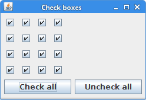

+++
title = "Selecting & deselecting all JCheckBox components"
date = 2025-08-27T23:21:00.046+01:00
draft = false
description = "In this tutorial, we show how to select and deselect all 
JCheckBox components in a Swing application."
image = "images/checkboxes.png"
imageBig = "images/checkboxes.png"
categories = ["articles"]
authors = ["Cude"]
avatar = "/images/avatar.webp"
+++

# Selecting &amp; deselecting all JCheckBox components

last modified July 13, 2020 

In this tutorial, we show how to select and deselect all JCheckBox components in a Swing
application.

Swing is the premier Java GUI toolkit. It is a part of the JFC (Java Foundation Classes), 
which is an API for providing a graphical user interface for Java programs. Swing is completely written in Java.
There is a concise [Java Swing tutorial](http://zetcode.com/tutorials/javaswingtutorial/)
on ZetCode.

JCheckBox is a component that can be selected or deselected, 
and which displays its state to the user. You can find more about JCheckBox 
in the [Basic Swing components II](http://zetcode.com/tutorials/javaswingtutorial/basicswingcomponentsII/)
chapter of the Java Swing tutorial.

The setSelected method is used to select and deselect a JCheckBox. 
The following example shows how to select and deselect all JCheckBox in an application.

com/zetcode/CheckUncheckEx.java
  

package com.zetcode;

import java.awt.Component;
import java.awt.EventQueue;
import java.awt.event.ActionEvent;
import javax.swing.AbstractAction;
import javax.swing.JButton;
import javax.swing.JCheckBox;
import javax.swing.JFrame;
import static javax.swing.JFrame.EXIT_ON_CLOSE;
import net.miginfocom.swing.MigLayout;

public class CheckUncheckEx extends JFrame {

    public CheckUncheckEx() {

        initUI();
    }

    private void initUI() {

        setLayout(new MigLayout("nogrid"));

        JCheckBox box1 = new JCheckBox();
        JCheckBox box2 = new JCheckBox();
        JCheckBox box3 = new JCheckBox();
        JCheckBox box4 = new JCheckBox();
        JCheckBox box5 = new JCheckBox();
        JCheckBox box6 = new JCheckBox();
        JCheckBox box7 = new JCheckBox();
        JCheckBox box8 = new JCheckBox();
        JCheckBox box9 = new JCheckBox();
        JCheckBox box10 = new JCheckBox();
        JCheckBox box11 = new JCheckBox();
        JCheckBox box12 = new JCheckBox();
        JCheckBox box13 = new JCheckBox();
        JCheckBox box14 = new JCheckBox();
        JCheckBox box15 = new JCheckBox();
        JCheckBox box16 = new JCheckBox();

        JButton btn1 = new JButton("Check all");
        btn1.addActionListener(new CheckAllAction());

        JButton btn2 = new JButton("Uncheck all");        
        btn2.addActionListener(new UnCheckAllAction());      

        add(box1);
        add(box2);
        add(box3);
        add(box4, "wrap");
        add(box5);
        add(box6);
        add(box7);
        add(box8, "wrap");
        add(box9);
        add(box10);
        add(box11);
        add(box12, "wrap");
        add(box13);
        add(box14);
        add(box15);
        add(box16, "wrap");

        add(btn1, "sgx");
        add(btn2, "sgx");

        pack();

        setTitle("Check boxes");
        setDefaultCloseOperation(EXIT_ON_CLOSE);
        setLocationRelativeTo(null);
    }
    
     private class CheckAllAction extends AbstractAction {

        @Override
        public void actionPerformed(ActionEvent e) {
            
            Component[] components = (Component[]) 
                    getContentPane().getComponents();

            for (Component comp : components) {

                if (comp instanceof JCheckBox) {
                    JCheckBox box = (JCheckBox) comp;
                    box.setSelected(true);
                }
            }            
        }
     }
     
     private class UnCheckAllAction extends AbstractAction {

        @Override
        public void actionPerformed(ActionEvent e) {
            
            Component[] components = (Component[]) 
                    getContentPane().getComponents();

            for (Component comp : components) {

                if (comp instanceof JCheckBox) {
                    JCheckBox box = (JCheckBox) comp;
                    box.setSelected(false);
                }
            }            
        }
     }     

    public static void main(String[] args) {

        EventQueue.invokeLater(() -&gt; {
            CheckUncheckEx ex = new CheckUncheckEx();
            ex.setVisible(true);
        });
    }
}

The example has sixteen check boxes and two buttons. The buttons check and uncheckall check boxes.

setLayout(new MigLayout("nogrid"));

A MigLayout manager is used to lay out components. MigLayout is a third-party 
layout manager; therefore, we need to download and include the manager's JARs. With the nogrid
constraint we create a flow-only layout. All components in the flow direction will be put in 
the same cell and will thus not be aligned with component in other rows/columns. 

JCheckBox box1 = new JCheckBox();
JCheckBox box2 = new JCheckBox();
JCheckBox box3 = new JCheckBox();
JCheckBox box4 = new JCheckBox();
...

Sixteen JCheckBox components are created.

JButton btn1 = new JButton("Check all");
btn1.addActionListener(new CheckAllAction());

A Check All button is created and an action listener is set.

add(box1);
add(box2);
add(box3);
add(box4, "wrap");

Check boxes are added to the layout; they form one row.

add(btn1, "sgx");
add(btn2, "sgx");

Using the sgx constraint, the buttons have the same size.

private class CheckAllAction extends AbstractAction {

    @Override
    public void actionPerformed(ActionEvent e) {
        
        Component[] components = (Component[]) 
                getContentPane().getComponents();

        for (Component comp : components) {

            if (comp instanceof JCheckBox) {
                JCheckBox box = (JCheckBox) comp;
                box.setSelected(true);
            }
        }            
    }
}

When we click on the Check All button, the CheckAllAction's actionPerformed
is called. Inside the method, we get all the components of the content pane with the getComponents 
method and find out all JCheckBoxes with the instanceof 
operator. The setSelected method selects the JCheckBoxes.

Figure: Check boxes

In this tutorial, we have shown how to select and deselect all JCheckBox components
in a Swing application.