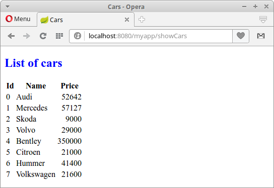

+++
title = "Spring Boot Mustache"
date = 2025-08-27T23:20:54.714+01:00
draft = false
description = "Spring Boot Mustache tutorial shows how to create
a simple Spring Boot web application with Mustache template engine and HSQLDB database."
image = "images/cars.png"
imageBig = "images/cars.png"
categories = ["articles"]
authors = ["Cude"]
avatar = "/images/avatar.webp"
+++

# Spring Boot Mustache

last modified July 13, 2020

In Spring Boot Mustache tutorial, we are going to create a simple Spring Boot web application
with Mustache template engine and HSQLDB database.

Spring is a popular Java application framework.
Spring Boot is an effort to create stand-alone, production-grade
Spring based applications without musch hassle.

HSQLDB is an open source relational database management system created
entirely in Java. It offers a small, fast multithreaded and transactional database
engine with in-memory and disk-based tables and supports embedded and server modes.
It includes a powerful command line SQL tool and simple GUI query tools.

## Mustache

Mustache is a simple web template system. It is available for many
programming languages including Java. Mustache is described as a logic-less
because it does not have any explicit control flow statements, such as if and else
conditionals or for loops. Looping and conditional evaluation can be achieved using
section tags processing lists and lambdas.

## Spring Boot Mustache example

The following example is a Spring Boot web application that uses Mustache template
engine. The data of the application is located in HSQLDB database.

$ tree
.
├── pom.xml
└── src
    ├── main
    │   ├── java
    │   │   └── com
    │   │       └── zetcode
    │   │           ├── Application.java
    │   │           ├── bean
    │   │           │   └── Car.java
    │   │           ├── controller
    │   │           │   └── MyController.java
    │   │           └── service
    │   │               ├── CarService.java
    │   │               └── ICarService.java
    │   └── resources
    │       ├── application.yml
    │       ├── data-hsqldb.sql
    │       ├── schema-hsqldb.sql
    │       ├── static
    │       │   └── css
    │       │       └── style.css
    │       └── templates
    │           ├── index.html
    │           └── showCars.html
    └── test
        └── java

This is the project structure. The template files have .html suffix;
they are located in the src/main/resources/template directory by default.
Spring Boot automatically configures Mustache when it finds the dependency in
the Maven POM file.

pom.xml
  

&lt;?xml version="1.0" encoding="UTF-8"?&gt;
&lt;project xmlns="http://maven.apache.org/POM/4.0.0"
         xmlns:xsi="http://www.w3.org/2001/XMLSchema-instance"
         xsi:schemaLocation="http://maven.apache.org/POM/4.0.0
                             http://maven.apache.org/xsd/maven-4.0.0.xsd"&gt;

    &lt;modelVersion&gt;4.0.0&lt;/modelVersion&gt;
    &lt;groupId&gt;com.zetcode&lt;/groupId&gt;
    &lt;artifactId&gt;SpringBootMustache&lt;/artifactId&gt;
    &lt;version&gt;1.0-SNAPSHOT&lt;/version&gt;
    &lt;packaging&gt;jar&lt;/packaging&gt;
    &lt;properties&gt;
        &lt;project.build.sourceEncoding&gt;UTF-8&lt;/project.build.sourceEncoding&gt;
        &lt;maven.compiler.source&gt;1.8&lt;/maven.compiler.source&gt;
        &lt;maven.compiler.target&gt;1.8&lt;/maven.compiler.target&gt;
    &lt;/properties&gt;

    &lt;parent&gt;
        &lt;groupId&gt;org.springframework.boot&lt;/groupId&gt;
        &lt;artifactId&gt;spring-boot-starter-parent&lt;/artifactId&gt;
        &lt;version&gt;1.5.3.RELEASE&lt;/version&gt;
    &lt;/parent&gt;

    &lt;dependencies&gt;

        &lt;dependency&gt;
            &lt;groupId&gt;org.hsqldb&lt;/groupId&gt;
            &lt;artifactId&gt;hsqldb&lt;/artifactId&gt;
        &lt;/dependency&gt;

        &lt;dependency&gt;
            &lt;groupId&gt;org.springframework.boot&lt;/groupId&gt;
            &lt;artifactId&gt;spring-boot-devtools&lt;/artifactId&gt;
            &lt;optional&gt;true&lt;/optional&gt;
        &lt;/dependency&gt;

        &lt;dependency&gt;
            &lt;groupId&gt;org.springframework.boot&lt;/groupId&gt;
            &lt;artifactId&gt;spring-boot-starter-mustache&lt;/artifactId&gt;
        &lt;/dependency&gt;

        &lt;dependency&gt;
            &lt;groupId&gt;org.springframework.boot&lt;/groupId&gt;
            &lt;artifactId&gt;spring-boot-starter-jdbc&lt;/artifactId&gt;
        &lt;/dependency&gt;

    &lt;/dependencies&gt;

    &lt;build&gt;
        &lt;plugins&gt;
            &lt;plugin&gt;
                &lt;groupId&gt;org.springframework.boot&lt;/groupId&gt;
                &lt;artifactId&gt;spring-boot-maven-plugin&lt;/artifactId&gt;
            &lt;/plugin&gt;
        &lt;/plugins&gt;
    &lt;/build&gt;
&lt;/project&gt;

This is the Maven build file. The spring-boot-devtools enables hot swapping,
disables template cache and enables live reloading. The spring-boot-starter-mustache
is starter for building Spring MVC applications with Mustache. The hsqldb is a driver
for HSQLDB. The spring-boot-starter-jdbc is a starter for using JDBC in Spring Boot.

com/zetcode/Car.java
  

package com.zetcode.bean;

public class Car {

    private Long id;
    private String name;
    private int price;

    public Car() {}

    public Car(Long id, String name, int price) {
        this.id = id;
        this.name = name;
        this.price = price;
    }

    public Long getId() {
        return id;
    }

    public void setId(Long id) {
        this.id = id;
    }

    public String getName() {
        return name;
    }

    public void setName(String name) {
        this.name = name;
    }

    public int getPrice() {
        return price;
    }

    public void setPrice(int price) {
        this.price = price;
    }

    @Override
    public String toString() {
        return "Car{" + "id=" + id + ", name=" + name + ", price=" + price + '}';
    }
}

This is Car bean class. It contains car id, name, and price fields.

application.yml
  

server:
    context-path: /myapp

spring:
    main:
        banner-mode: "off"
    datasource:
        platform: hsqldb

logging:
    level:
        org:
            springframework: ERROR

The application.yml is the main Spring Boot configuration
file. The context-path defines the name of the web application.
We access our application at localhost:8080/myapp/ URL.
With the banner-mode property we turn off the Spring banner.
The platform value is used in SQL initialization scripts: schema-${platform}.sql
and data-${platform}.sql. Also, we set the logging level for spring framework
to ERROR.

Notice that we do not configure the datasource; Spring automatically configures HSQLDB in the
in-memory mode if there is no configuration data. We wanted to have an in-memory database,
so we leave Spring to do the automatic configuration.

schema-hsqldb.sql
  

CREATE TABLE CARS(ID BIGINT IDENTITY PRIMARY KEY,
                  NAME VARCHAR(30), PRICE INT);

This SQL script creates the CARS table. HSQLDB uses IDENTITY
clause to create auto-incremented columns. By default, the ids start from zero.

data-hsqldb.sql
  

INSERT INTO CARS(NAME, PRICE) VALUES('Audi', 52642);
INSERT INTO CARS(NAME, PRICE) VALUES('Mercedes', 57127);
INSERT INTO CARS(NAME, PRICE) VALUES('Skoda', 9000);
INSERT INTO CARS(NAME, PRICE) VALUES('Volvo', 29000);
INSERT INTO CARS(NAME, PRICE) VALUES('Bentley', 350000);
INSERT INTO CARS(NAME, PRICE) VALUES('Citroen', 21000);
INSERT INTO CARS(NAME, PRICE) VALUES('Hummer', 41400);
INSERT INTO CARS(NAME, PRICE) VALUES('Volkswagen', 21600);

This script fills the table with data. Both scripts are located
in the root of the classpath.

com/zetcode/ICarService.java
  

package com.zetcode.service;

import com.zetcode.bean.Car;
import java.util.List;

public interface ICarService {

    public List&lt;Car&gt; findAll();
}

ICarService provides a contract method to
get all cities from the data source.

com/zetcode/CarService.java
  

package com.zetcode.service;

import com.zetcode.bean.Car;
import java.util.List;
import org.springframework.beans.factory.annotation.Autowired;
import org.springframework.jdbc.core.BeanPropertyRowMapper;
import org.springframework.jdbc.core.JdbcTemplate;
import org.springframework.stereotype.Service;

@Service
public class CarService implements ICarService {

    @Autowired
    private JdbcTemplate jtm;

    @Override
    public List&lt;Car&gt; findAll() {

        String sql = "SELECT * FROM CARS";

        List&lt;Car&gt; cars = jtm.query(sql, new BeanPropertyRowMapper(Car.class));

        return cars;
    }
}

CarService contains the implementation of
the findAll method. We retrieve all cars from
the CARS table with the help of the JdbcTemplate.

@Autowired
private JdbcTemplate jtm;

JdbcTemplate is injected.

String sql = "SELECT * FROM CARS";

This is SQL to be executed. We select all cars from the CARS table.

List&lt;Car&gt; cars = jtm.query(sql, new BeanPropertyRowMapper(Car.class));

BeanPropertyRowMapper converts a row into a new instance of the
specified mapped target class.

com/zetcode/MyController.java
  

package com.zetcode.controller;

import com.zetcode.bean.Car;
import com.zetcode.service.ICarService;
import java.util.HashMap;
import java.util.List;
import java.util.Map;
import org.springframework.beans.factory.annotation.Autowired;
import org.springframework.stereotype.Controller;
import org.springframework.ui.Model;
import org.springframework.web.bind.annotation.RequestMapping;
import org.springframework.web.servlet.ModelAndView;

@Controller
public class MyController {

    @Autowired
    private ICarService carService;

    @RequestMapping("/")
    public String index(Model model) {

        return "index";
    }

    @RequestMapping("/showCars")
    public ModelAndView showCars() {

        List&lt;Car&gt; cars = carService.findAll();

        Map&lt;String, Object&gt; params = new HashMap&lt;&gt;();
        params.put("cars", cars);

        return new ModelAndView("showCars", params);
    }
}

This is the controller class for the Spring Boot web application. A controller is decorated with
the @Controller annotation. The  controller has two mappings: one mapping for the
home page and one for listing all cars. Spring Boot automatically configures Mustache views when
it detects Mustache starter in the Maven POM file.

@Autowired
private ICarService carService;

We inject the ICarService into the field with the @Autowired
annotation.

@RequestMapping("/")
public String index(Model model) {

    return "index";
}

The "index" is the name of the view located in the predefined
template directory.

@RequestMapping("/showCars")
public ModelAndView showCars() {

    List&lt;Car&gt; cars = carService.findAll();

    Map&lt;String, Object&gt; params = new HashMap&lt;&gt;();
    params.put("cars", cars);

    return new ModelAndView("showCars", params);
}

This controller method serves a list of cars. We find all car objects
from the car service and place the resulting list into the parameters.
Spring will locate the Mustache view named showCars and
let the engine join the template with the data.

style.css
  

h2 {color: blue}

td:nth-child(3) {
    text-align: right;
}

The style.css is a static file located in the
src/main/resources/static/css directory. It sets the h2
tag to blue colour and right aligns the data of the third column.

index.html
  

&lt;!DOCTYPE html&gt;
&lt;html&gt;
    &lt;head&gt;
        &lt;title&gt;Home page&lt;/title&gt;
        &lt;meta charset="UTF-8"/&gt;
        &lt;meta name="viewport" content="width=device-width, initial-scale=1.0"/&gt;
    &lt;/head&gt;
    &lt;body&gt;
        &lt;a href="showCars"&gt;Show cars&lt;/a&gt;
    &lt;/body&gt;
&lt;/html&gt;

The index.html template file is the home page of the application. It contains
a link to retrieve all car objects.

showCars.html
  

&lt;!DOCTYPE html&gt;
&lt;html&gt;
    &lt;head&gt;
        &lt;title&gt;Cars&lt;/title&gt;
        &lt;link rel="stylesheet" href="css/style.css" /&gt;
        &lt;meta charset="UTF-8"/&gt;
        &lt;meta name="viewport" content="width=device-width, initial-scale=1.0"/&gt;
    &lt;/head&gt;
    &lt;body&gt;
        &lt;h2&gt;List of cars&lt;/h2&gt;

        &lt;table&gt;
            &lt;tr&gt;
                &lt;th&gt;Id&lt;/th&gt;
                &lt;th&gt;Name&lt;/th&gt;
                &lt;th&gt;Price&lt;/th&gt;
            &lt;/tr&gt;
            {{#cars}}
            &lt;tr&gt;
                &lt;td&gt;{{id}}&lt;/td&gt;
                &lt;td&gt;{{name}}&lt;/td&gt;
                &lt;td&gt;{{price}}&lt;/td&gt;
            &lt;/tr&gt;
            {{/cars}}
        &lt;/table&gt;
    &lt;/body&gt;
&lt;/html&gt;

The showCars.html is a Mustache template file that contains
placeholders to be filled with data from the model.

Mustache uses {{}} syntax.

&lt;link rel="stylesheet" href="css/style.css" /&gt;

We include the static CSS file.

{{#cars}}
&lt;tr&gt;
    &lt;td&gt;{{id}}&lt;/td&gt;
    &lt;td&gt;{{name}}&lt;/td&gt;
    &lt;td&gt;{{price}}&lt;/td&gt;
&lt;/tr&gt;
{{/cars}}

The {{#cars}} syntax is called a section. Sections render blocks of
text one or more times, depending on the value of the key in the current
context. A section begins with {{#name}} and ends with
{{/name}}. If the value is a non-empty list the section will be
displayed multiple times. In each case the context of the section will be set to
the element in the list.

com/zetcode/Application.java
  

package com.zetcode;

import org.springframework.boot.SpringApplication;
import org.springframework.boot.autoconfigure.SpringBootApplication;

@SpringBootApplication
public class Application {

    public static void main(String[] args) {
        SpringApplication.run(Application.class, args);
    }
}

We set up the Spring Boot application. The @SpringBootApplication
annotation enables auto-configuration and component scanning.

Figure: Listing cars

The application is deployed on the built-in Tomcat server, which listens on port 8080.

In this tutorial, we have created a Spring Boot web application with Mustache
and HSQLDB.