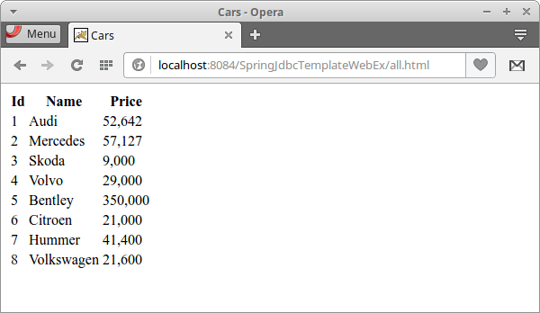

+++
title = "Spring HikariCP"
date = 2025-08-29T19:48:47.126+01:00
draft = false
description = "In this tutorial, we show how to use HikariCP connection pool with a classic Spring application. In the application, we connect to the MySQL database with Spring JdbcTemplate."
image = "images/application.png"
imageBig = "images/application.png"
categories = ["articles"]
authors = ["Cude"]
avatar = "/images/avatar.webp"
+++

# Spring HikariCP

last modified July 13, 2020 

In this tutorial, we show how to use HikariCP connection pool in a classic 
Spring application. In the application, we connect to the MySQL database with 
Spring JdbcTemplate. We use FreeMarker as template engine. The application is
deployed on Tomcat server.

Spring is a popular Java application framework for developing enterprise 
applications in Java. It is also a very good integration system
that helps glue together various enterprise components.

HikariCP is solid high-performance JDBC connection pool. A connection pool 
is a cache of database connections maintained by the database system for reusing connections 
when future requests to the database are required. With a connection pool we can
significantly reduce the overall resource usage.

JdbcTemplate is a Spring library that helps programmers create applications that work
with relational databases and JDBC. It takes care of many tedious and error-prone low-level 
details such as handling transactions, cleaning up resources, and correctly handling 
exceptions. JdbcTemplate is shipped in Spring's spring-jdbc module.

cars.sql
  

-- SQL for the Cars table

START TRANSACTION;
DROP TABLE IF EXISTS Cars;

CREATE TABLE Cars(Id INTEGER PRIMARY KEY, Name VARCHAR(50), Price INTEGER);
INSERT INTO Cars VALUES(1, 'Audi', 52642);
INSERT INTO Cars VALUES(2, 'Mercedes', 57127);
INSERT INTO Cars VALUES(3, 'Skoda', 9000);
INSERT INTO Cars VALUES(4, 'Volvo', 29000);
INSERT INTO Cars VALUES(5, 'Bentley', 350000);
INSERT INTO Cars VALUES(6, 'Citroen', 21000);
INSERT INTO Cars VALUES(7, 'Hummer', 41400);
INSERT INTO Cars VALUES(8, 'Volkswagen', 21600);
COMMIT;

In the code example, we use this table.

mysql&gt; source cars.sql

With the mysql command line tool and its source command, we 
create the Cars table. The [MySQL tutorial](/databases/mysqltutorial/)
provides more information about how to set up and use MySQL database.

├── pom.xml
└── src
    ├── main
    │   ├── java
    │   │   └── com
    │   │       └── zetcode
    │   │           ├── bean
    │   │           │   └── Car.java
    │   │           ├── service
    │   │           │   └── CarService.java
    │   │           └── web
    │   │              └── MyController.java
    │   ├── resources
    │   │   └── application-context.xml
    │   └── webapp
    │       ├── META-INF
    │       │   └── context.xml
    │       └── WEB-INF
    │           ├── spring-servlet.xml
    │           ├── views
    │           │   ├── allCars.ftl
    │           │   └── index.ftl
    │           └── web.xml
    └── test
        └── java

This is the project structure.

pom.xml
  

&lt;?xml version="1.0" encoding="UTF-8"?&gt;
&lt;project xmlns="http://maven.apache.org/POM/4.0.0" 
         xmlns:xsi="http://www.w3.org/2001/XMLSchema-instance" 
         xsi:schemaLocation="http://maven.apache.org/POM/4.0.0 
                             http://maven.apache.org/xsd/maven-4.0.0.xsd"&gt;
    
    &lt;modelVersion&gt;4.0.0&lt;/modelVersion&gt;

    &lt;groupId&gt;com.zetcode&lt;/groupId&gt;
    &lt;artifactId&gt;SpringJdbcTemplateWebEx&lt;/artifactId&gt;
    &lt;version&gt;1.0-SNAPSHOT&lt;/version&gt;
    &lt;packaging&gt;war&lt;/packaging&gt;

    &lt;name&gt;SpringJdbcTemplateWebEx&lt;/name&gt;

    &lt;properties&gt;
        &lt;project.build.sourceEncoding&gt;UTF-8&lt;/project.build.sourceEncoding&gt;
        &lt;maven.compiler.source&gt;1.8&lt;/maven.compiler.source&gt;
        &lt;maven.compiler.target&gt;1.8&lt;/maven.compiler.target&gt;        
        &lt;spring-version&gt;4.3.7.RELEASE&lt;/spring-version&gt;
    &lt;/properties&gt;
    
    &lt;dependencies&gt;
        
        &lt;dependency&gt;
            &lt;groupId&gt;mysql&lt;/groupId&gt;
            &lt;artifactId&gt;mysql-connector-java&lt;/artifactId&gt;
            &lt;version&gt;5.1.40&lt;/version&gt;
        &lt;/dependency&gt;              
        
        &lt;dependency&gt;
            &lt;groupId&gt;org.freemarker&lt;/groupId&gt;
            &lt;artifactId&gt;freemarker&lt;/artifactId&gt;
            &lt;version&gt;2.3.25-incubating&lt;/version&gt;
        &lt;/dependency&gt;   
        
         &lt;!--Needed for freemarker FreeMarkerConfigurer--&gt; 
        &lt;dependency&gt;
            &lt;groupId&gt;org.springframework&lt;/groupId&gt;
            &lt;artifactId&gt;spring-context-support&lt;/artifactId&gt;
            &lt;version&gt;${spring-version}&lt;/version&gt;
        &lt;/dependency&gt;                
        
        &lt;dependency&gt;
            &lt;groupId&gt;com.zaxxer&lt;/groupId&gt;
            &lt;artifactId&gt;HikariCP&lt;/artifactId&gt;
            &lt;version&gt;2.5.1&lt;/version&gt;
        &lt;/dependency&gt;      
        
        &lt;dependency&gt;
            &lt;groupId&gt;org.slf4j&lt;/groupId&gt;
            &lt;artifactId&gt;slf4j-simple&lt;/artifactId&gt;
            &lt;version&gt;1.7.22&lt;/version&gt;
        &lt;/dependency&gt;          
        
        &lt;dependency&gt;
            &lt;groupId&gt;org.springframework&lt;/groupId&gt;
            &lt;artifactId&gt;spring-webmvc&lt;/artifactId&gt;
            &lt;version&gt;${spring-version}&lt;/version&gt;
        &lt;/dependency&gt;         
        
        &lt;dependency&gt;
            &lt;groupId&gt;org.springframework&lt;/groupId&gt;
            &lt;artifactId&gt;spring-jdbc&lt;/artifactId&gt;
            &lt;version&gt;${spring-version}&lt;/version&gt;
        &lt;/dependency&gt;              
        
    &lt;/dependencies&gt;

    &lt;build&gt;
        &lt;plugins&gt;
            &lt;plugin&gt;
                &lt;groupId&gt;org.apache.maven.plugins&lt;/groupId&gt;
                &lt;artifactId&gt;maven-war-plugin&lt;/artifactId&gt;
                &lt;version&gt;2.3&lt;/version&gt;
                &lt;configuration&gt;
                    &lt;failOnMissingWebXml&gt;false&lt;/failOnMissingWebXml&gt;
                &lt;/configuration&gt;
            &lt;/plugin&gt;
        &lt;/plugins&gt;
    &lt;/build&gt;

&lt;/project&gt;

In this Maven build file, we provide dependencies for the core of 
the Spring application, HikariCP connection pool, FreeMarker template engine, 
JdbcTemplate library, and MySQL driver.

web.xml
  

&lt;?xml version="1.0" encoding="UTF-8"?&gt;

&lt;web-app xmlns="http://xmlns.jcp.org/xml/ns/javaee"
         xmlns:xsi="http://www.w3.org/2001/XMLSchema-instance"
         xsi:schemaLocation="http://xmlns.jcp.org/xml/ns/javaee 
                 http://xmlns.jcp.org/xml/ns/javaee/web-app_3_1.xsd"
         version="3.1"&gt;
    
    &lt;servlet&gt;
        &lt;servlet-name&gt;spring&lt;/servlet-name&gt;
        &lt;servlet-class&gt;
            org.springframework.web.servlet.DispatcherServlet
        &lt;/servlet-class&gt;
        &lt;load-on-startup&gt;1&lt;/load-on-startup&gt;
    &lt;/servlet&gt;
    
    &lt;servlet-mapping&gt;
        &lt;servlet-name&gt;spring&lt;/servlet-name&gt;
        &lt;url-pattern&gt;*.html&lt;/url-pattern&gt;
    &lt;/servlet-mapping&gt;    
    
    &lt;session-config&gt;
        &lt;session-timeout&gt;
            30
        &lt;/session-timeout&gt;
    &lt;/session-config&gt;
&lt;/web-app&gt;

In the web.xml file, we set up the Spring DispatcherServlet.
DispatcherServlet is a central dispatcher for HTTP request handlers.

context.xml
  

&lt;?xml version="1.0" encoding="UTF-8"?&gt;
&lt;Context path="/SpringJdbcTemplateWebEx"&gt;

    &lt;Resource name="jdbc/myDs" auth="Container"
              factory="com.zaxxer.hikari.HikariJNDIFactory"
              dataSourceClassName="com.mysql.jdbc.jdbc2.optional.MysqlDataSource"
              dataSource.url="jdbc:mysql://localhost/testdb?useSSL=false"
              type="javax.sql.DataSource"
              minimumIdle="5" 
              maximumPoolSize="10"
              connectionTimeout="300000"
              database="testdb"
              server="localhost"
              dataSource.user="testuser"
              dataSource.password="test623"
              dataSource.cachePrepStmts="true"
              dataSource.prepStmtCacheSize="250"
              dataSource.prepStmtCacheSqlLimit="2048"
              closeMethod="close"
    /&gt;
    
&lt;/Context&gt;

Tomcat's context.xml file contains the data source definition.
The data source uses HikariCP connection pool.

spring-servlet.xml
  

&lt;?xml version="1.0" encoding="UTF-8"?&gt;

&lt;beans xmlns="http://www.springframework.org/schema/beans"
       xmlns:xsi="http://www.w3.org/2001/XMLSchema-instance"
       xmlns:mvc="http://www.springframework.org/schema/mvc"
       xmlns:context="http://www.springframework.org/schema/context"
       xsi:schemaLocation="http://www.springframework.org/schema/mvc http://www.springframework.org/schema/mvc/spring-mvc.xsd
   http://www.springframework.org/schema/beans http://www.springframework.org/schema/beans/spring-beans.xsd
   http://www.springframework.org/schema/context http://www.springframework.org/schema/context/spring-context.xsd"&gt;

    &lt;context:component-scan base-package="com.zetcode" /&gt;
    &lt;import resource="classpath:application-context.xml" /&gt;
    
    &lt;bean id="freemarkerConfig" class="org.springframework.web.servlet.view.freemarker.FreeMarkerConfigurer"&gt;
        &lt;property name="templateLoaderPath" value="/WEB-INF/views/"/&gt;
    &lt;/bean&gt;

    &lt;bean id="viewResolver" class="org.springframework.web.servlet.view.freemarker.FreeMarkerViewResolver"&gt;
        &lt;property name="cache" value="true"/&gt;
        &lt;property name="prefix" value=""/&gt;
        &lt;property name="suffix" value=".ftl"/&gt;
    &lt;/bean&gt;   
                
&lt;/beans&gt;

In the spring servlet context XML file we define two beans: freemarkerConfig and 
viewResolver. These are configuration beans for FreeMarker.
The spring-servlet.xml is located in the WEB-INF subdirectory. 

&lt;context:component-scan base-package="com.zetcode" /&gt;

We enable component scanning for com.zetcode package.

&lt;import resource="classpath:application-context.xml" /&gt;

We import another context file, called application-context.xml.
It is located on the classpath—in the src/main/resources directory.

application-context.xml
  

&lt;?xml version="1.0" encoding="UTF-8"?&gt;
&lt;beans xmlns="http://www.springframework.org/schema/beans"
       xmlns:xsi="http://www.w3.org/2001/XMLSchema-instance"
       xsi:schemaLocation="http://www.springframework.org/schema/beans 
                          http://www.springframework.org/schema/beans/spring-beans.xsd"&gt;

    &lt;bean id="dataSource" class="org.springframework.jndi.JndiObjectFactoryBean"&gt;
        &lt;property name="jndiName" value="java:comp/env/jdbc/myDs"/&gt;
    &lt;/bean&gt;    
    
    &lt;bean id="jdbcTemplate" class="org.springframework.jdbc.core.JdbcTemplate"&gt;
        &lt;property name="dataSource" ref="dataSource"/&gt;
    &lt;/bean&gt;    

&lt;/beans&gt;

In the application-context.xml we define two beans: dataSource
and jdbcTemplate.

com/zetcode/Car.java
  

package com.zetcode.bean;

public class Car {
    
    private int Id;
    private String Name;
    private int Price;

    public int getId() {
        return Id;
    }

    public void setId(int Id) {
        this.Id = Id;
    }

    public String getName() {
        return Name;
    }

    public void setName(String Name) {
        this.Name = Name;
    }

    public int getPrice() {
        return Price;
    }

    public void setPrice(int Price) {
        this.Price = Price;
    }

    @Override
    public String toString() {
        return "Car{" + "Id=" + Id + ", Name=" + 
                Name + ", Price=" + Price + '}';
    }
}

This is a Car class. A row from the database
table will be mapped to this class.

com/zetcode/CarService.java
  

package com.zetcode.service;

import com.zetcode.bean.Car;
import java.util.List;
import org.springframework.beans.factory.annotation.Autowired;
import org.springframework.jdbc.core.BeanPropertyRowMapper;
import org.springframework.jdbc.core.JdbcTemplate;
import org.springframework.stereotype.Service;

@Service
public class CarService {

    @Autowired
    public JdbcTemplate jdbcTemplate;

    public List&lt;Car&gt; getAllCars() {

        String sql = "SELECT * FROM Cars";

        List&lt;Car&gt; cars = jdbcTemplate.query(sql, 
                new BeanPropertyRowMapper(Car.class));
        return cars;
    }
}

The CarService is a service class that contains a method
to retrieve all cars from the database.

@Autowired
public JdbcTemplate jdbcTemplate;

The JdbcTemplate is injected with the @Autowired annotation.

List&lt;Car&gt; cars = jdbcTemplate.query(sql, 
        new BeanPropertyRowMapper(Car.class));

With the JdbcTemplate's query method we execute the SQL 
query. The result object is mapped to the Car object using 
the BeanPropertyRowMapper.

com/zetcode/MyController.java
  

package com.zetcode.web;

import com.zetcode.bean.Car;
import com.zetcode.service.CarService;
import java.util.List;
import org.springframework.beans.factory.annotation.Autowired;
import org.springframework.stereotype.Controller;
import org.springframework.ui.Model;
import org.springframework.web.bind.annotation.RequestMapping;
import org.springframework.web.bind.annotation.RequestMethod;
import org.springframework.web.servlet.ModelAndView;

@Controller
public class MyController {

    @Autowired
    private CarService carService;

    @RequestMapping("/index")
    public String index(Model model) {

        return "index";
    }

    @RequestMapping(value = "/all", method = RequestMethod.GET)
    public ModelAndView all() {

        List&lt;Car&gt; cars = carService.getAllCars();

        ModelAndView model = new ModelAndView("allCars");
        model.addObject("cars", cars);

        return model;
    }
}

MyController is a controller class. It has mappings for two request URLs:
/index and /all.

@Autowired
private CarService carService;

The CarService is injected.

@RequestMapping("/index")
public String index(Model model) {

    return "index";
}

This request is resolved by returning index.ftl file.
The views are located in the WEB-INF/views directory.

@RequestMapping(value = "/all", method = RequestMethod.GET)
public ModelAndView all() {

    List&lt;Car&gt; cars = carService.getAllCars();

    ModelAndView model = new ModelAndView("allCars");
    model.addObject("cars", cars);

    return model;
}

Here we call the getAllCars method of the CarService
and create a ModelAndView object. The retrieved data is sent to the 
allCars.ftl template.

index.ftl
  

&lt;!DOCTYPE html&gt;
&lt;html&gt;
    &lt;head&gt;
        &lt;title&gt;Home page&lt;/title&gt;
        &lt;meta charset="UTF-8"&gt;
        &lt;meta name="viewport" content="width=device-width, initial-scale=1.0"&gt;
    &lt;/head&gt;
    &lt;body&gt;
        &lt;p&gt;Showing &lt;a href="all.html"&gt;all cars&lt;/a&gt;&lt;/p&gt;
    &lt;/body&gt;
&lt;/html&gt;

This is the index.ftl file.

allCars.ftl
  

&lt;!DOCTYPE html&gt;
&lt;html&gt;
    &lt;head&gt;
        &lt;title&gt;Cars&lt;/title&gt;
        &lt;meta charset="UTF-8"&gt;
        &lt;meta name="viewport" content="width=device-width, initial-scale=1.0"&gt;
        &lt;/head&gt;
    &lt;body&gt;
        
        &lt;table&gt;
            &lt;tr&gt;
                &lt;th&gt;Id&lt;/th&gt;  
                &lt;th&gt;Name&lt;/th&gt;  
                &lt;th&gt;Price&lt;/th&gt;
            &lt;/tr&gt;        

            &lt;#list cars as car&gt;
                &lt;tr&gt;
                    &lt;td&gt;${car.id}&lt;/td&gt; 
                    &lt;td&gt;${car.name}&lt;/td&gt; 
                    &lt;td&gt;${car.price}&lt;/td&gt;
                &lt;/tr&gt;
            &lt;/#list&gt;        
        &lt;/table&gt;                
    &lt;/body&gt;
&lt;/html&gt;

This template file processes data sent from the database.

&lt;#list cars as car&gt;

The #list directive lists a collection of data.

Figure: Showing all cars

The data from the MySQL database is displayed in Opera browser.

In this tutorial, we have created a classic Spring application that executed SQL
statements with JdbcTemplate against MySQL database. We used HikariCP connection
pool. The Spring application was using FreeMarker template engine and was
deployed on Tomcat server.