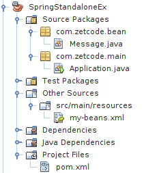

+++
title = "Standalone Spring applications"
date = 2025-08-27T23:21:00.173+01:00
draft = false
description = "In this tutorial, we are going to create simple
Java Spring standalone applications. One application will use an XML file, the other
one annotations."
image = "images/netbeans_project.png"
imageBig = "images/netbeans_project.png"
categories = ["articles"]
authors = ["Cude"]
avatar = "/images/avatar.webp"
+++

# Standalone Spring applications

last modified July 13, 2020

In this tutorial, we are going to create two simple Java Spring standalone
applications. We will use NetBeans to build the applications.

Spring is a popular Java application framework. It provides various
libraries and tools for enterprise application programming. It is also a very
good integration system that helps glue together various enterprise components.

Spring ApplicationContext is a central interface to provide
configuration for an application. ClassPathXmlApplicationContext is
an implementation of the ApplicationContext that loads
configuration definition from an XML file, which is located on the classpath.
AnnotationConfigApplicationContext creates a new application
context deriving bean definitions from the given annotated classes.

pom.xml
  

&lt;?xml version="1.0" encoding="UTF-8"?&gt;
&lt;project xmlns="http://maven.apache.org/POM/4.0.0"
         xmlns:xsi="http://www.w3.org/2001/XMLSchema-instance"
         xsi:schemaLocation="http://maven.apache.org/POM/4.0.0 http://maven.apache.org/xsd/maven-4.0.0.xsd"&gt;

    &lt;modelVersion&gt;4.0.0&lt;/modelVersion&gt;
    &lt;groupId&gt;com.zetcode&lt;/groupId&gt;
    &lt;artifactId&gt;SpringStandaloneEx2&lt;/artifactId&gt;
    &lt;version&gt;1.0-SNAPSHOT&lt;/version&gt;
    &lt;packaging&gt;jar&lt;/packaging&gt;

    &lt;properties&gt;

        &lt;project.build.sourceEncoding&gt;UTF-8&lt;/project.build.sourceEncoding&gt;
        &lt;maven.compiler.source&gt;1.8&lt;/maven.compiler.source&gt;
        &lt;maven.compiler.target&gt;1.8&lt;/maven.compiler.target&gt;
        &lt;spring-version&gt;4.3.0.RELEASE&lt;/spring-version&gt;

    &lt;/properties&gt;

    &lt;dependencies&gt;

        &lt;dependency&gt;
            &lt;groupId&gt;org.springframework&lt;/groupId&gt;
            &lt;artifactId&gt;spring-core&lt;/artifactId&gt;
            &lt;version&gt;${spring-version}&lt;/version&gt;
        &lt;/dependency&gt;

        &lt;dependency&gt;
            &lt;groupId&gt;org.springframework&lt;/groupId&gt;
            &lt;artifactId&gt;spring-beans&lt;/artifactId&gt;
            &lt;version&gt;${spring-version}&lt;/version&gt;
        &lt;/dependency&gt;

        &lt;dependency&gt;
            &lt;groupId&gt;org.springframework&lt;/groupId&gt;
            &lt;artifactId&gt;spring-context&lt;/artifactId&gt;
            &lt;version&gt;${spring-version}&lt;/version&gt;
        &lt;/dependency&gt;

    &lt;/dependencies&gt;

&lt;/project&gt;

We use this Maven build file for both applications. It contains the necessary
Spring dependencies.

## Spring application with ClassPathXmlApplicationContext

We create a new Maven Java SE application in NetBeans IDE.

Figure: Spring project structure in NetBeans

In the project, there are four files: Message.java, Application.java,
my-beans.xml, and pom.xml.

com/zetcode/Message.java
  

package com.zetcode.bean;

public class Message {

   private String message;

   public void setMessage(String message){

      this.message = message;
   }

   public String getMessage(){

      return message;
   }
}

Message is a simple Java bean used in our application.

my-beans.xml
  

&lt;?xml version="1.0" encoding="UTF-8"?&gt;

&lt;beans xmlns="http://www.springframework.org/schema/beans"
    xmlns:xsi="http://www.w3.org/2001/XMLSchema-instance"
    xsi:schemaLocation="http://www.springframework.org/schema/beans
    http://www.springframework.org/schema/beans/spring-beans.xsd"&gt;

   &lt;bean id="mymessage" class="com.zetcode.bean.Message"&gt;
       &lt;property name="message" value="Hello there!"/&gt;
   &lt;/bean&gt;

&lt;/beans&gt;

We make the Message class into a Spring bean; it is
now managed by the Spring container. We also provide a value
for the message property. The my-beans.xml is
located in the src/main/resources subdirectory.

com/zetcode/Application.java
  

package com.zetcode.main;

import com.zetcode.bean.Message;
import org.springframework.context.ApplicationContext;
import org.springframework.context.support.ClassPathXmlApplicationContext;

public class Application {

   public static void main(String[] args) {

      ApplicationContext context =
             new ClassPathXmlApplicationContext("my-beans.xml");

      Message obj = (Message) context.getBean("mymessage");

      String msg = obj.getMessage();
      System.out.println(msg);
   }
}

The Application sets up the Spring application.

ApplicationContext context =
        new ClassPathXmlApplicationContext("my-beans.xml");

From the my-beans.xml file, we create the ApplicationContext.

Message obj = (Message) context.getBean("mymessage");

From the application context, we retrieve the Message bean.

String msg = obj.getMessage();
System.out.println(msg);

We call the bean's getMessage method and print the message to
the console.

Hello there!

This is the output of the application.

## Spring application with AnnotationConfigApplicationContext

In the second example, we are going to use a AnnotationConfigApplicationContext
to create the Spring ApplicationContext.

com/zetcode/Message.java
  

package com.zetcode.bean;

import org.springframework.stereotype.Component;

@Component
public class Message {

   private String message = "Hello there!";

   public void setMessage(String message){

      this.message  = message;
   }

   public String getMessage(){

      return message;
   }
}

The Message bean is decorated with the @Component annotation.
Such classes are auto-detected by Spring.

com/zetcode/Application.java
  

package com.zetcode.main;

import com.zetcode.bean.Message;
import org.springframework.beans.factory.annotation.Autowired;
import org.springframework.context.ApplicationContext;
import org.springframework.context.annotation.AnnotationConfigApplicationContext;
import org.springframework.context.annotation.ComponentScan;

@ComponentScan(basePackages = "com.zetcode")
public class Application {

    public static void main(String[] args) {

        ApplicationContext context
                = new AnnotationConfigApplicationContext(Application.class);

        Application p = context.getBean(Application.class);
        p.start();
    }

    @Autowired
    private Message message;
    private void start() {
        System.out.println("Message: " + message.getMessage());
    }
}

This is the main Application class.

@ComponentScan(basePackages = "com.zetcode")

With the @ComponentScan annotation we tell Spring where to look
for components.

ApplicationContext context
        = new AnnotationConfigApplicationContext(Application.class);

The ApplicationContext is created from annotations.

@Autowired
private Message message;
private void start() {
    System.out.println("Message: " + message.getMessage());
}

With the @Autowired annotation, the Message bean is
injected into the message variable.

In this tutorial, we have created two standalone Spring application. The first
one was using an XML file, the second one relied on annotations.