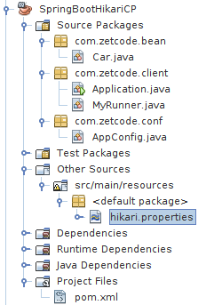

+++
title = "Using HikariCP connection pool"
date = 2025-08-29T19:48:32.114+01:00
draft = false
description = "In this tutorial, we show how to set up HikariCP in a Java console and Spring Boot console applications."
image = "images/spring_boot_hikaricp.png"
imageBig = "images/spring_boot_hikaricp.png"
categories = ["articles"]
authors = ["Cude"]
avatar = "/images/avatar.webp"
+++

# Using HikariCP connection pool

last modified July 13, 2020 

In this tutorial, we introduce HikariCP and show how to set up HicariCP connection 
pool in Java applications. In our applications, we make requests to the MySQL database.

HikariCP is solid high-performance JDBC connection pool. A connection pool 
is a cache of database connections maintained so that the connections can be reused when
future requests to the database are required. Connection pools may significantly reduce the
overall resource usage.

Java Database Connectivity (JDBC) is a Java API for accessing relational 
databases. It provides methods for querying and updating data in a database.
Spring Boot is Spring's convention-over-configuration solution for creating 
stand-alone, production-grade Spring applications quickly.
JdbcTemplate is a library that helps programmers create applications that work
with relational databases and JDBC. It handles many tedious and error-prone low-level 
details such as handling transactions, cleaning up resources, and correctly handling 
exceptions.

cars.sql
  

-- SQL for the Cars table

START TRANSACTION;
DROP TABLE IF EXISTS Cars;

CREATE TABLE Cars(Id INTEGER PRIMARY KEY, Name VARCHAR(50), Price INTEGER);
INSERT INTO Cars VALUES(1, 'Audi', 52642);
INSERT INTO Cars VALUES(2, 'Mercedes', 57127);
INSERT INTO Cars VALUES(3, 'Skoda', 9000);
INSERT INTO Cars VALUES(4, 'Volvo', 29000);
INSERT INTO Cars VALUES(5, 'Bentley', 350000);
INSERT INTO Cars VALUES(6, 'Citroen', 21000);
INSERT INTO Cars VALUES(7, 'Hummer', 41400);
INSERT INTO Cars VALUES(8, 'Volkswagen', 21600);
COMMIT;

In the examples, we use this table.

mysql&gt; source cars.sql

The mysql command line tool can be used to create the table with litte effort. 
You can have a look at [MySQL tutorial](/databases/mysqltutorial/)
for more information about how to set up and use MySQL database.

## HikariCP in a console application

In the following example, we use HikariCP is a Java console application. 

pom.xml
  

&lt;?xml version="1.0" encoding="UTF-8"?&gt;
&lt;project xmlns="http://maven.apache.org/POM/4.0.0" 
         xmlns:xsi="http://www.w3.org/2001/XMLSchema-instance" 
         xsi:schemaLocation="http://maven.apache.org/POM/4.0.0 
                             http://maven.apache.org/xsd/maven-4.0.0.xsd"&gt;

    &lt;modelVersion&gt;4.0.0&lt;/modelVersion&gt;
    &lt;groupId&gt;com.zetcode&lt;/groupId&gt;
    &lt;artifactId&gt;HikariCPEx&lt;/artifactId&gt;
    &lt;version&gt;1.0-SNAPSHOT&lt;/version&gt;
    &lt;packaging&gt;jar&lt;/packaging&gt;
    &lt;properties&gt;
        &lt;project.build.sourceEncoding&gt;UTF-8&lt;/project.build.sourceEncoding&gt;
        &lt;maven.compiler.source&gt;1.8&lt;/maven.compiler.source&gt;
        &lt;maven.compiler.target&gt;1.8&lt;/maven.compiler.target&gt;
    &lt;/properties&gt;
    
    &lt;dependencies&gt;
    
        &lt;dependency&gt;
            &lt;groupId&gt;mysql&lt;/groupId&gt;
            &lt;artifactId&gt;mysql-connector-java&lt;/artifactId&gt;
            &lt;version&gt;5.1.40&lt;/version&gt;
        &lt;/dependency&gt;
        
        &lt;dependency&gt;
            &lt;groupId&gt;com.zaxxer&lt;/groupId&gt;
            &lt;artifactId&gt;HikariCP&lt;/artifactId&gt;
            &lt;version&gt;2.5.1&lt;/version&gt;
        &lt;/dependency&gt;      
        
        &lt;dependency&gt;
            &lt;groupId&gt;org.slf4j&lt;/groupId&gt;
            &lt;artifactId&gt;slf4j-simple&lt;/artifactId&gt;
            &lt;version&gt;1.7.22&lt;/version&gt;
        &lt;/dependency&gt;             
    
    &lt;/dependencies&gt;
    &lt;name&gt;HikariCPEx&lt;/name&gt;
&lt;/project&gt;

In the Maven build file, we provide the dependencies for the core of 
the MySQL driver, HikariCP collection pool, and slf4j-simple library.
(HikariCP requires slf4j).

db.properties
  

jdbcUrl=jdbc:mysql://localhost:3306/testdb?useSSL=false
dataSource.user=testuser
dataSource.password=test623
dataSource.cachePrepStmts=true
dataSource.prepStmtCacheSize=250
dataSource.prepStmtCacheSqlLimit=2048

In the db.properties file, we have configuration settings for
the datasource. The file is located in the src/main/resources
directory.

com/zetcode/HikariCPEx.java
  

package com.zetcode;

import com.zaxxer.hikari.HikariConfig;
import com.zaxxer.hikari.HikariDataSource;
import java.sql.Connection;
import java.sql.PreparedStatement;
import java.sql.ResultSet;
import java.sql.SQLException;
import java.util.logging.Level;
import java.util.logging.Logger;

public class HikariCPEx {

    public static void main(String[] args) {

        String configFile = "src/main/resources/db.properties";
        
        HikariConfig cfg = new HikariConfig(configFile);
        HikariDataSource ds = new HikariDataSource(cfg);

        Connection con = null;
        PreparedStatement pst = null;
        ResultSet rs = null;

        try {

            con = ds.getConnection();
            pst = con.prepareStatement("SELECT * FROM Cars");
            rs = pst.executeQuery();

            while (rs.next()) {

                System.out.format("%d %s %d %n", rs.getInt(1), rs.getString(2), 
                        rs.getInt(3));
            }

        } catch (SQLException ex) {

            Logger lgr = Logger.getLogger(HikariCPEx.class.getName());
            lgr.log(Level.SEVERE, ex.getMessage(), ex);

        } finally {

            try {
            
                if (rs != null) {
                    rs.close();
                }
                
                if (pst != null) {
                    pst.close();
                }
                
                if (con != null) {
                    con.close();
                }
                
                ds.close();

            } catch (SQLException ex) {

                Logger lgr = Logger.getLogger(HikariCPEx.class.getName());
                lgr.log(Level.WARNING, ex.getMessage(), ex);
            }
        }
    }
}

The example connects to a MySQL database and selects all cars from its 
Cars table.

String configFile = "src/main/resources/db.properties";

HikariConfig cfg = new HikariConfig(configFile);

We use the database properties to create a HikariConfig object,
which is used to create a data source.

HikariDataSource ds = new HikariDataSource(cfg);

A HikariDataSource is created.

con = ds.getConnection();

From the data source we get the connection with the 
getConnection method.

pst = con.prepareStatement("SELECT * FROM Cars");
rs = pst.executeQuery();

We create a prepared statement, a pre-compiled statement, which is executed
later with the executeQuery method.

ds.close();

The close method shuts down the data source and its associated pool.

## HikariCP in Spring Boot application

In the second application, we use HikariCP in a Spring Boot application. The application
is a simple Spring Boot console application.

Figure: NetBeans project structure

The project consists of six files: pom.xml, hikari.properties, 
Car.java, Application.java,  MyRunner.java, and 
AppConfig.java. 

pom.xml
  

&lt;?xml version="1.0" encoding="UTF-8"?&gt;
&lt;project xmlns="http://maven.apache.org/POM/4.0.0" 
         xmlns:xsi="http://www.w3.org/2001/XMLSchema-instance" 
         xsi:schemaLocation="http://maven.apache.org/POM/4.0.0 
                 http://maven.apache.org/xsd/maven-4.0.0.xsd"&gt;
    
    &lt;modelVersion&gt;4.0.0&lt;/modelVersion&gt;
    &lt;groupId&gt;com.zetcode&lt;/groupId&gt;
    &lt;artifactId&gt;SpringBootHikariCP&lt;/artifactId&gt;
    &lt;version&gt;1.0-SNAPSHOT&lt;/version&gt;
    &lt;packaging&gt;jar&lt;/packaging&gt;
    &lt;properties&gt;
        &lt;project.build.sourceEncoding&gt;UTF-8&lt;/project.build.sourceEncoding&gt;
        &lt;maven.compiler.source&gt;1.8&lt;/maven.compiler.source&gt;
        &lt;maven.compiler.target&gt;1.8&lt;/maven.compiler.target&gt;
    &lt;/properties&gt;
    
    &lt;parent&gt;
        &lt;groupId&gt;org.springframework.boot&lt;/groupId&gt;
        &lt;artifactId&gt;spring-boot-starter-parent&lt;/artifactId&gt;
        &lt;version&gt;1.4.3.RELEASE&lt;/version&gt;
        &lt;relativePath /&gt;
    &lt;/parent&gt;     
    
    &lt;dependencies&gt;
 
        &lt;dependency&gt;
            &lt;groupId&gt;mysql&lt;/groupId&gt;
            &lt;artifactId&gt;mysql-connector-java&lt;/artifactId&gt;            
        &lt;/dependency&gt; 
        
        &lt;dependency&gt;
            &lt;groupId&gt;org.springframework.boot&lt;/groupId&gt;
            &lt;artifactId&gt;spring-boot-starter-jdbc&lt;/artifactId&gt;
        &lt;/dependency&gt;
        
        &lt;dependency&gt;
            &lt;groupId&gt;org.springframework.boot&lt;/groupId&gt;
            &lt;artifactId&gt;spring-boot-starter&lt;/artifactId&gt;
        &lt;/dependency&gt;
        
        &lt;dependency&gt;
            &lt;groupId&gt;com.zaxxer&lt;/groupId&gt;
            &lt;artifactId&gt;HikariCP&lt;/artifactId&gt;
        &lt;/dependency&gt;         

    &lt;/dependencies&gt;
    
    &lt;name&gt;SpringBootHikariCP&lt;/name&gt;
&lt;/project&gt;

This is the pom.xml file. It contains dependencies for
Spring Boot, MySQL driver, and HikariCP. Spring Boot automatically takes
care of the logging dependencies.

com/zetcode/Car.java
  

package com.zetcode.bean;

public class Car {

    private Long Id;
    private String name;
    private int price;

    public Long getId() {
        return Id;
    }

    public void setId(Long Id) {
        this.Id = Id;
    }

    public String getName() {
        return name;
    }

    public void setName(String name) {
        this.name = name;
    }

    public int getPrice() {
        return price;
    }

    public void setPrice(int price) {
        this.price = price;
    }

    @Override
    public String toString() {
        return "Car{" + "Id=" + Id + ", name=" + 
                name + ", price=" + price + '}';
    }
}

This is a simple Car bean that will map
to a row in the Cars table.

hikari.properties
  

driverClassName=com.mysql.jdbc.Driver
jdbcUrl=jdbc:mysql://localhost:3306/testdb?useSSL=false
maximumPoolSize=20
username=testuser
password=test623
dataSource.cachePrepStmts=true
dataSource.prepStmtCacheSize=250
dataSource.prepStmtCacheSqlLimit=2048

The hikari.properties file, located in src/main/resources
directory, contains HikariCP configuration options.

com/zetcode/AppConfig.java
  

package com.zetcode.conf;

import com.zaxxer.hikari.HikariConfig;
import com.zaxxer.hikari.HikariDataSource;
import java.sql.SQLException;
import javax.sql.DataSource;
import org.springframework.context.annotation.Bean;
import org.springframework.context.annotation.Configuration;

@Configuration
public class AppConfig {

    @Bean(destroyMethod = "close")
    public DataSource dataSource() throws SQLException {
        HikariConfig config = new HikariConfig("/hikari.properties");
        HikariDataSource dataSource = new HikariDataSource(config);

        return dataSource;
    }
}

The AppConfig is a configuration bean that 
sets up HikariDataSource. The @Bean annotation 
indicates that a method produces a bean to be managed by the Spring container.

com/zetcode/Application.java
  

package com.zetcode.client;

import org.springframework.boot.SpringApplication;
import org.springframework.boot.autoconfigure.EnableAutoConfiguration;
import org.springframework.context.annotation.ComponentScan;

@EnableAutoConfiguration
@ComponentScan(basePackages="com.zetcode")
public class Application {

    public static void main(String[] args) {

        SpringApplication.run(Application.class, args);
    }
}

The Application class builds the application. 
The @EnableAutoConfiguration annotation enables 
Spring Boot auto-configuration. The @ComponentScan annotation
tells Spring where to look for beans to create.

com/zetcode/MyRunner.java
  

package com.zetcode.client;

import com.zetcode.bean.Car;
import java.util.List;
import org.springframework.beans.factory.annotation.Autowired;
import org.springframework.boot.CommandLineRunner;
import org.springframework.jdbc.core.BeanPropertyRowMapper;
import org.springframework.jdbc.core.JdbcTemplate;
import org.springframework.stereotype.Component;

@Component
public class MyRunner implements CommandLineRunner {

    @Autowired
    protected JdbcTemplate jtm;

    @Override
    public void run(String... args) throws Exception {

        String sql = "SELECT * FROM Cars";

        List&lt;Car&gt; cars = jtm.query(sql, new BeanPropertyRowMapper(Car.class));

        cars.stream().forEach(System.out::println);
    }
}

In the MyRunner class, we inject the JdbcTemplate object
and execute its query method. The BeanPropertyRowMapper
maps database table rows to Car beans.