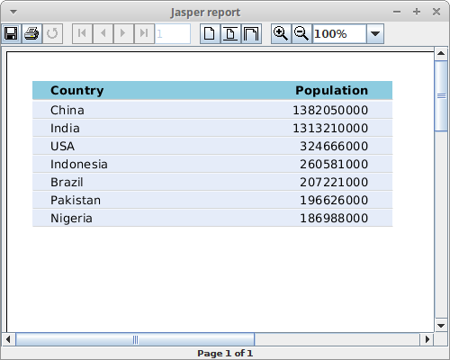

+++
title = "Using JasperReports' JRViewer to display report"
date = 2025-08-27T23:20:43.834+01:00
draft = false
description = "In this tutorial, we show how to display
our report with JRViewer component. The report is shown in a small Swing
application."
image = "images/countries.png"
imageBig = "images/countries.png"
categories = ["articles"]
authors = ["Cude"]
avatar = "/images/avatar.webp"
+++

# Using JasperReports' JRViewer to display report

last modified October 13, 2021 

In this tutorial, we show how display a report created with JasperReports
library with JRViewer component.

JasperReports is an open-source reporting library. It can create
reports in various formats including PDF, HTML, XLS, or CSV. 
JRViewer is a component used in Swing-based applications to view the
reports generated by JasperReports.

The following application loads data from a bean collection data source and
creates a report from it with JasperReports library. The report is displayed in
a small Swing application with the help of the 
JRViewer component.

src
├───main
│   ├───java
│   │   └───com
│   │       └───zetcode
│   │           │   GuiRunner.java
│   │           │   PrintFileGenerator.java
│   │           │
│   │           └───bean
│   │                   Country.java
│   └───resources
│           report2.xml
└───test
    └───java

This is the project structure.

pom.xml
  

&lt;?xml version="1.0" encoding="UTF-8"?&gt;
&lt;project xmlns="http://maven.apache.org/POM/4.0.0"
         xmlns:xsi="http://www.w3.org/2001/XMLSchema-instance"
         xsi:schemaLocation="http://maven.apache.org/POM/4.0.0 http://maven.apache.org/xsd/maven-4.0.0.xsd"&gt;
    &lt;modelVersion&gt;4.0.0&lt;/modelVersion&gt;

    &lt;groupId&gt;com.zetcode&lt;/groupId&gt;
    &lt;artifactId&gt;JasperViewer&lt;/artifactId&gt;
    &lt;version&gt;1.0-SNAPSHOT&lt;/version&gt;

    &lt;properties&gt;
        &lt;maven.compiler.source&gt;17&lt;/maven.compiler.source&gt;
        &lt;maven.compiler.target&gt;17&lt;/maven.compiler.target&gt;
    &lt;/properties&gt;

    &lt;dependencies&gt;

        &lt;dependency&gt;
            &lt;groupId&gt;net.sf.jasperreports&lt;/groupId&gt;
            &lt;artifactId&gt;jasperreports&lt;/artifactId&gt;
            &lt;version&gt;6.17.0&lt;/version&gt;
        &lt;/dependency&gt;

    &lt;/dependencies&gt;

&lt;/project&gt;

The Maven pom.xml file contains the jasperreports dependency.

com/zetcode/bean/Country.java
  

package com.zetcode.bean;

public class Country {

    private String name;
    private int population;

    public Country(String name, int population) {
        this.name = name;
        this.population = population;
    }

    public String getName() {
        return name;
    }

    public void setName(String name) {
        this.name = name;
    }

    public int getPopulation() {
        return population;
    }

    public void setPopulation(int population) {
        this.population = population;
    }
}

This is a bean class. It contains country name and population attributes.

resources/report2.xml
  

&lt;?xml version = "1.0" encoding = "UTF-8"?&gt;
&lt;!DOCTYPE jasperReport PUBLIC "//JasperReports//DTD Report Design//EN"
        "http://jasperreports.sourceforge.net/dtds/jasperreport.dtd"&gt;

&lt;jasperReport xmlns="http://jasperreports.sourceforge.net/jasperreports"
              xmlns:xsi="http://www.w3.org/2001/XMLSchema-instance"
              xsi:schemaLocation="http://jasperreports.sourceforge.net/jasperreports
                      http://jasperreports.sourceforge.net/xsd/jasperreport.xsd"
              name="report2" topMargin="20" bottomMargin="20"&gt;

    &lt;style name="boldtext" isBold="true"/&gt;
    &lt;style name="background1" mode="Opaque" backcolor="#8DCCE0"/&gt;
    &lt;style name="background2" mode="Opaque" backcolor="#E5ECF9"/&gt;

    &lt;field name="name"/&gt;
    &lt;field name="population" class="java.lang.Integer"/&gt;

    &lt;columnHeader&gt;
        &lt;band height="20"&gt;

            &lt;staticText&gt;
                &lt;reportElement x="0" y="3" width="300" height="15" style="background1"/&gt;

                &lt;box&gt;
                    &lt;bottomPen lineWidth="1.0" lineColor="#CCCCCC"/&gt;
                &lt;/box&gt;

                &lt;textElement/&gt;
                &lt;text&gt;&lt;![CDATA[]]&gt;&lt;/text&gt;
            &lt;/staticText&gt;

            &lt;staticText&gt;
                &lt;reportElement x="15" y="5" width="130" height="15" style="boldtext"/&gt;

                &lt;textElement textAlignment="Left"/&gt;

                &lt;text&gt;&lt;![CDATA[Country]]&gt;&lt;/text&gt;
            &lt;/staticText&gt;

            &lt;staticText&gt;
                &lt;reportElement x="150" y="5" width="130" height="15" style="boldtext"/&gt;

                &lt;textElement textAlignment="Right"/&gt;

                &lt;text&gt;&lt;![CDATA[Population]]&gt;&lt;/text&gt;
            &lt;/staticText&gt;

        &lt;/band&gt;
    &lt;/columnHeader&gt;

    &lt;detail&gt;
        &lt;band height="15"&gt;

            &lt;staticText&gt;
                &lt;reportElement x="0" y="0" width="300" height="14" style="background2"/&gt;

                &lt;box&gt;
                    &lt;bottomPen lineWidth="0.5" lineColor="#CCCCCC"/&gt;
                &lt;/box&gt;

                &lt;textElement/&gt;
                &lt;text&gt;&lt;![CDATA[]]&gt; &lt;/text&gt;
            &lt;/staticText&gt;

            &lt;textField&gt;
                &lt;reportElement x="15" y="0" width="130" height="15"/&gt;

                &lt;textElement textAlignment="Left" verticalAlignment="Middle"/&gt;

                &lt;textFieldExpression class="java.lang.String"&gt;
                    &lt;![CDATA[$F{name}]]&gt;
                &lt;/textFieldExpression&gt;
            &lt;/textField&gt;

            &lt;textField&gt;
                &lt;reportElement x="150" y="0" width="130" height="15"/&gt;
                &lt;textElement textAlignment="Right" verticalAlignment="Middle"/&gt;

                &lt;textFieldExpression class="java.lang.Integer"&gt;
                    &lt;![CDATA[$F{population}]]&gt;
                &lt;/textFieldExpression&gt;
            &lt;/textField&gt;

        &lt;/band&gt;
    &lt;/detail&gt;

&lt;/jasperReport&gt;

This is the report template file. The template contains two bands: columnHeader
and detail.

&lt;style name="boldtext" isBold="true"/&gt;
&lt;style name="background1" mode="Opaque" backcolor="#8DCCE0"/&gt;
&lt;style name="background2" mode="Opaque" backcolor="#E5ECF9"/&gt;

There are three styles used in the template. Styles create modularity and 
reduce repetition in code.

&lt;field name="name"/&gt;
&lt;field name="population" class="java.lang.Integer"/&gt;

There are two fields in the template. Fields are mapped to the elements of
the data source. In our case, fields are mapped to the attributes of the beans.
(We are using JRBeanCollectionDataSource.)

&lt;staticText&gt;
    &lt;reportElement x="15" y="5" width="130" height="15" style="boldtext"/&gt;

    &lt;textElement textAlignment="Left"/&gt;

    &lt;text&gt;&lt;![CDATA[Country]]&gt;&lt;/text&gt;
&lt;/staticText&gt;

&lt;staticText&gt; is used to display labels in the report.
This static text shows a column header.

&lt;textField&gt;
    &lt;reportElement x="15" y="0" width="130" height="15"/&gt;

    &lt;textElement textAlignment="Left" verticalAlignment="Middle"/&gt;

    &lt;textFieldExpression class = "java.lang.String"&gt;
        &lt;![CDATA[$F{name}]]&gt;
    &lt;/textFieldExpression&gt;
&lt;/textField&gt;

A text field is an element which contains an associated expression that is
evaluated with every iteration in the data source to obtain the text content to
be displayed. This text field displays country names. A text field in a detail
band is evaluated for each record in the data source. Since we have seven beans
in our JRBeanCollectionDataSource, the text field is evaluated
seven times.

com/zetcode/PrintFileGenerator.java
  

package com.zetcode;

import com.zetcode.bean.Country;
import net.sf.jasperreports.engine.JRException;
import net.sf.jasperreports.engine.JasperCompileManager;
import net.sf.jasperreports.engine.JasperFillManager;
import net.sf.jasperreports.engine.JasperPrint;
import net.sf.jasperreports.engine.data.JRBeanCollectionDataSource;

import java.util.ArrayList;
import java.util.HashMap;

public class PrintFileGenerator {

    public static JasperPrint generate() throws JRException {

        var xmlFile = "src/main/resources/report2.xml";

        var jasperReport = JasperCompileManager.compileReport(xmlFile);
        var beanColDataSource = new JRBeanCollectionDataSource(getBeans());

        var params = new HashMap&lt;String, Object&gt;();

        return JasperFillManager.fillReport(jasperReport, params, beanColDataSource);
    }

    private static ArrayList&lt;Country&gt; getBeans() {

        var beans = new ArrayList&lt;Country&gt;();

        beans.add(new Country("China", 1_382_050_000));
        beans.add(new Country("India", 1_313_210_000));
        beans.add(new Country("USA", 324_666_000));
        beans.add(new Country("Indonesia", 260_581_000));
        beans.add(new Country("Brazil", 207_221_000));
        beans.add(new Country("Pakistan", 196_626_000));
        beans.add(new Country("Nigeria", 186_988_000));

        return beans;
    }
}

The PrintFileGenerator creates a JasperPrint file from 
the data source. JasperPrint represents a page-oriented 
document that can be viewed, printed, or exported to other formats. In our case, 
it is going to be viewed with JRViewer.

var xmlFile = "src/main/resources/report2.xml";

var jasperReport = JasperCompileManager.compileReport(xmlFile);

We compile the XML template file into a JasperReport.
JasperReport is a compiled template ready to be filled
with data.

var beanColDataSource = new JRBeanCollectionDataSource(getBeans());

JRBeanCollectionDataSource is a data source implementation that
wraps a collection of Java bean objects. We put seven Country
beans into the data source.

return JasperFillManager.fillReport(jasperReport, params, beanColDataSource);

With the JasperFillManager.fillReport method, we create a
JasperPrint object; an object that can be viewed, printed, or
exported to other formats.

com/zetcode/GuiRunner.java
  

package com.zetcode;

import net.sf.jasperreports.swing.JRViewer;

import javax.swing.JFrame;
import java.awt.Dimension;
import java.awt.EventQueue;

public class GuiRunner {

    public static void main(String[] args) throws Exception {

        var jrPrint = PrintFileGenerator.generate();

        EventQueue.invokeLater(() -&gt; {

            var frame = new JFrame("Jasper report");
            var viewer = new JRViewer(jrPrint);

            frame.add(viewer);
            frame.setSize(new Dimension(750, 700));
            frame.setLocationRelativeTo(null);
            frame.setDefaultCloseOperation(JFrame.EXIT_ON_CLOSE);
            frame.setVisible(true);
        });
    }
}

The GuiRunner sets up a Java Swing application that displays
our report.

var viewer = new JRViewer(jrPrint);

We pass the generated JasperPrint to the JRViewer.

frame.add(viewer);

the JRViewer is added to the frame.

Figure: Countries

The screenshot shows the Jasper viewer displaying the report.

In this tutorial, we have created a report with JasperReports library and
displayed it in a Swing application with JRViewer.