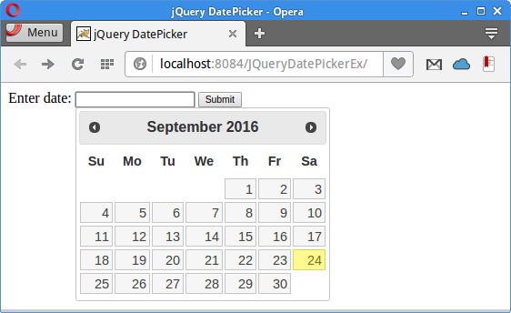

+++
title = "Using jQuery DatePicker in JSP and PHP"
date = 2025-08-27T23:20:52.145+01:00
draft = false
description = "In jQuery DatePicker tutorial, we show how to use jQuery DatePicker component. The chosen date is displayed in Java JSP and PHP pages."
image = "images/picker.png"
imageBig = "images/picker.png"
categories = ["articles"]
authors = ["Cude"]
avatar = "/images/avatar.webp"
+++

# Using jQuery DatePicker in JSP and PHP

last modified July 13, 2020 

In jQuery DatePicker tutorial, we show how to use the jQuery DatePicker
component. The chosen date is displayed in a in Java JSP 
and PHP pages.

jQuery is a fast, small, and feature-rich JavaScript library. It
makes HTML document traversal and manipulation, event handling, animation, and
Ajax much simpler with an easy-to-use API that works across a multitude of
browsers. jQuery UI is a set of user interface widgets, effects,
interactions, and themes built on top of the jQuery Library. 

DatePicker is one of the UI widgets of the jQuery UI library. 
It is used for selecting a date value.

## Java web application

In the following example, we use a DatePicker component to select a date.
The selected date is sent and displayed in a JSP page.

index.html
  

&lt;!DOCTYPE html&gt;
&lt;html&gt;
    &lt;head&gt;
        &lt;title&gt;jQuery DatePicker&lt;/title&gt;
        &lt;meta charset="UTF-8"&gt;
        &lt;meta name="viewport" content="width=device-width, initial-scale=1.0"&gt;
        &lt;link rel="stylesheet" href="https://code.jquery.com/ui/1.12.1/themes/base/jquery-ui.css"&gt;
        &lt;script src="https://code.jquery.com/jquery-1.12.4.js"&gt;&lt;/script&gt;
        &lt;script src="https://code.jquery.com/ui/1.12.1/jquery-ui.js"&gt;&lt;/script&gt;
        &lt;script&gt;
            $(function () {
                $("#datepicker").datepicker();
            });
        &lt;/script&gt;

    &lt;/head&gt;
    &lt;body&gt;
        &lt;form action="showDate.jsp"&gt;
            &lt;label for="datepicker"&gt;Enter date:&lt;/label&gt;
                &lt;input type="text" name="selDate" id="datepicker"&gt;
            
            &lt;input type="submit" value="Submit"&gt;
        &lt;/form&gt;
            
    &lt;/body&gt;
&lt;/html&gt;

In the index.html file, we use the DatePicker component
in a form tag. The action attribute points to the showDate.jsp
page.

&lt;link rel="stylesheet" href="https://code.jquery.com/ui/1.12.1/themes/base/jquery-ui.css"&gt;
&lt;script src="https://code.jquery.com/jquery-1.12.4.js"&gt;&lt;/script&gt;
&lt;script src="https://code.jquery.com/ui/1.12.1/jquery-ui.js"&gt;&lt;/script&gt;

We include the JavaScript libraries and CSS styles for the DatePicker component.

&lt;script&gt;
    $(function () {
        $("#datepicker").datepicker();
    });
&lt;/script&gt;

The DatePicker component is created.

&lt;input type="text" name="selDate" id="datepicker"&gt;

The DatePicker is tied to this input tag.

showDate.jsp
  

&lt;%@page contentType="text/html" pageEncoding="UTF-8"%&gt;
&lt;!DOCTYPE html&gt;
&lt;html&gt;
    &lt;head&gt;
        &lt;meta http-equiv="Content-Type" content="text/html; charset=UTF-8"&gt;
        &lt;title&gt;Showing date&lt;/title&gt;
    &lt;/head&gt;
    &lt;body&gt;
        &lt;p&gt;
            The chosen date is &lt;%= request.getParameter("selDate") %&gt;
        &lt;/p&gt;
    &lt;/body&gt;
&lt;/html&gt;

In the showDate.jsp file, the selected date is printed.

## PHP application

The next instructions show how to adapt the example for a PHP application.

&lt;form action="showDate.php"&gt;

The form's action attribute points to the showDate.php file.

showDate.php
  

&lt;?php
    echo "The chosen date is: " . $_GET["selDate"];
?&gt;

The date is printed.

Figure: jQuery DatePicker

In this tutorial, we have used jQuery DatePicker in a Java web and PHP applications.