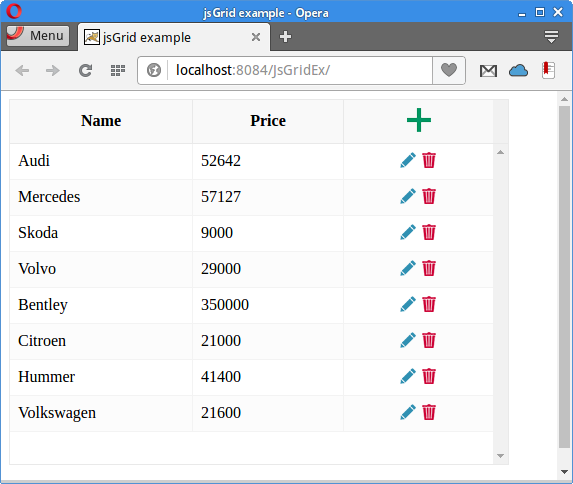

+++
title = "Using jsGrid component"
date = 2025-08-27T23:20:52.995+01:00
draft = false
description = "In this tutorial, we retrieve data from a Derby database and display it in a jsGrid component."
image = "images/jsgrid.png"
imageBig = "images/jsgrid.png"
categories = ["articles"]
authors = ["Cude"]
avatar = "/images/avatar.webp"
+++

# Using jsGrid component

last modified July 13, 2020 

In this tutorial, we retrieve data from a Derby database and display it in a 
jsGrid component. The data is sent from Derby to jsGrid in a JSON format.
Sources for this tutorial are available in the authors Github 
[repository](https://github.com/janbodnar/jsGrid-Servlet).

jsGrid is a lightweight client-side data grid control based on jQuery. 
It supports basic grid operations like inserting, editing, filtering, deleting, sorting, and paging. 
The jsGrid component allows to customize its appearance and its subcomponents.

jQuery is a fast, small, and feature-rich JavaScript library. 
It makes HTML document traversal and manipulation, event handling, animation, and Ajax much simpler 
with an easy-to-use API that works across a multitude of browsers.

Apache Derby is an open source relational database implemented 
entirely in Java. Derby has a small footprint and is easy to deploy and install. 
It has two modes: embedded and client/server. It is also called Java DB.

JSON (JavaScript Object Notation) is a lightweight data-interchange format. 
It is easy for humans to read and write and for machines to parse and generate.
The official Internet media type for JSON is application/json. 
The JSON filename extension is .json.

In our application, we are going to use the following four HTTP methods:

    - GET — reads a resource

    - POST — creates a new resource

    - PUT — modifies a resource

    - DELETE — deletes a resoruce

These HTTP verbs will invoke the corresponding Java servlet methods.

cars.sql
  

CREATE TABLE CARS(ID INTEGER NOT NULL PRIMARY KEY GENERATED ALWAYS AS IDENTITY 
    (START WITH 1, INCREMENT BY 1), NAME VARCHAR(30), PRICE INT);

INSERT INTO CARS(NAME, PRICE) VALUES('Audi', 52642);
INSERT INTO CARS(NAME, PRICE) VALUES('Mercedes', 57127);
INSERT INTO CARS(NAME, PRICE) VALUES('Skoda', 9000);
INSERT INTO CARS(NAME, PRICE) VALUES('Volvo', 29000);
INSERT INTO CARS(NAME, PRICE) VALUES('Bentley', 350000);
INSERT INTO CARS(NAME, PRICE) VALUES('Citroen', 21000);
INSERT INTO CARS(NAME, PRICE) VALUES('Hummer', 41400);
INSERT INTO CARS(NAME, PRICE) VALUES('Volkswagen', 21600);

In the example, we use the CARS database table, which is
located in a Derby testdb database.

&lt;dependencies&gt;
    &lt;dependency&gt;
        &lt;groupId&gt;javax&lt;/groupId&gt;
        &lt;artifactId&gt;javaee-web-api&lt;/artifactId&gt;
        &lt;version&gt;7.0&lt;/version&gt;
        &lt;scope&gt;provided&lt;/scope&gt;
    &lt;/dependency&gt;
    
    &lt;dependency&gt;
        &lt;groupId&gt;org.apache.derby&lt;/groupId&gt;
        &lt;artifactId&gt;derbyclient&lt;/artifactId&gt;
        &lt;version&gt;10.12.1.1&lt;/version&gt;
    &lt;/dependency&gt;    

    &lt;dependency&gt;
        &lt;groupId&gt;com.googlecode.json-simple&lt;/groupId&gt;
        &lt;artifactId&gt;json-simple&lt;/artifactId&gt;
        &lt;version&gt;1.1.1&lt;/version&gt;
    &lt;/dependency&gt;
    
    &lt;dependency&gt;
        &lt;groupId&gt;com.google.guava&lt;/groupId&gt;
        &lt;artifactId&gt;guava&lt;/artifactId&gt;
        &lt;version&gt;19.0&lt;/version&gt;
    &lt;/dependency&gt;

    &lt;dependency&gt;
        &lt;groupId&gt;org.apache.derby&lt;/groupId&gt;
        &lt;artifactId&gt;derbyoptionaltools&lt;/artifactId&gt;
        &lt;version&gt;10.12.1.1&lt;/version&gt;
    &lt;/dependency&gt;        
    
&lt;/dependencies&gt;

These are the dependencies used in our project. The javaee-web-api 
is a set of JARs for creating a Java web application. The derbyclient 
is a database driver for Derby. The json-simple library is used
working with JSON data. The guava's helper method is used in this 
project. The derbyoptionaltools contains a helper method which
transforms a database result set into a JSON format.

index.html
  

&lt;!DOCTYPE html&gt;
&lt;html&gt;
    &lt;head&gt;
        &lt;title&gt;jsGrid example&lt;/title&gt;
        &lt;meta http-equiv="Content-Type" content="text/html; charset=UTF-8"&gt;
        &lt;meta name="viewport" content="width=device-width"&gt;
        &lt;link href="css/style.css" rel="stylesheet"&gt;
        &lt;link href="http://js-grid.com/css/jsgrid.min.css" rel="stylesheet"&gt;
        &lt;link href="http://js-grid.com/css/jsgrid-theme.min.css" rel="stylesheet"&gt;        
    &lt;/head&gt;
    &lt;body&gt;

        &lt;div id="jsGrid"&gt;&lt;/div&gt;

        &lt;script src="http://code.jquery.com/jquery-1.11.3.min.js"&gt;&lt;/script&gt;
        &lt;script src="http://js-grid.com/js/jsgrid.min.js"&gt;&lt;/script&gt;
        &lt;script src="js/sample.js"&gt;&lt;/script&gt;
    &lt;/body&gt;
&lt;/html&gt;

In the index.html file, we include the jQuery and jsGrid libraries.

&lt;div id="jsGrid"&gt;&lt;/div&gt;

The jsGrid is included as a div tag.

style.css
  

html {
    height: 100%;
}

body {
    height: 100%;
    font-family: Verdana, Georgia;
}

In order to show the jsGrid component in its full size, we need to
set the height of the &lt;body&gt; and &lt;html&gt; tags.

sample.js
  

$(function () {

    $.ajax({
        type: "GET",
        url: "/JsGridEx/ManageCars"
    }).done(function () {

        $("#jsGrid").jsGrid({
            height: "60%",
            width: "50%",
            inserting: true,
            editing: true,
            sorting: true,
            paging: true,
            autoload: true,
            pageSize: 10,
            controller: {
                loadData: function (filter) {
                    return $.ajax({
                        type: "GET",
                        url: "/JsGridEx/ManageCars",
                        data: filter
                    });
                },
                insertItem: function (item) {
                    return $.ajax({
                        type: "POST",
                        url: "/JsGridEx/ManageCars",
                        data: item
                    });
                },
                updateItem: function (item) {
                    return $.ajax({
                        type: "PUT",
                        url: "/JsGridEx/ManageCars",
                        data: item
                    });
                },
                deleteItem: function (item) {
                    return $.ajax({
                        type: "DELETE",
                        url: "/JsGridEx/ManageCars",
                        data: item
                    });
                }
            },
            fields: [
                {name: "NAME", title: "Name", type: "text", width: 60},
                {name: "PRICE", title: "Price", type: "text",  width: 50},
                {type: "control"}
            ]
        });

    });
});

In the sample.js file, we create and configure the jsGrid component.

inserting: true,
editing: true,
sorting: true,
paging: true,

Our jsGrid component enables to insert, edit, and sort data and also supports
paging.

loadData: function (filter) {
    return $.ajax({
        type: "GET",
        url: "/JsGridEx/ManageCars",
        data: filter
    });
}

The loadData function issues a HTTP GET method on the
ManageCars servlet.

insertItem: function (item) {
    return $.ajax({
        type: "POST",
        url: "/JsGridEx/ManageCars",
        data: item
    });
}

When we insert a new item, a HTTP POST method is issued on
the ManageCars servlet.

updateItem: function (item) {
    return $.ajax({
        type: "PUT",
        url: "/JsGridEx/ManageCars",
        data: item
    });
}

Updating an item generates a HTTP PUT method on the 
ManageCars servlet.

deleteItem: function (item) {
    return $.ajax({
        type: "DELETE",
        url: "/JsGridEx/ManageCars",
        data: item
    });
}

Deleting an item generates a HTTP DELETE method on the 
ManageCars servlet.

fields: [
    {name: "NAME", title: "Name", type: "text", width: 60},
    {name: "PRICE", title: "Price", type: "text",  width: 50},
    {type: "control"}
]

The jsGrid component has three two columns: NAME and PRICE.
They must exactly match the keys returned in JSON.

com/zetcode/ManageCars.java
  

package com.zetcode.web;

import com.zetcode.service.CarService;
import com.zetcode.util.Utils;
import java.io.IOException;
import java.util.Map;
import javax.servlet.ServletException;
import javax.servlet.annotation.WebServlet;
import javax.servlet.http.HttpServlet;
import javax.servlet.http.HttpServletRequest;
import javax.servlet.http.HttpServletResponse;
import org.json.simple.JSONArray;

@WebServlet(name = "ManageCars", urlPatterns = {"/ManageCars"})
public class ManageCars extends HttpServlet {

    @Override
    protected void doGet(HttpServletRequest request, HttpServletResponse response)
            throws ServletException, IOException {

        response.setContentType("application/json");
        response.setCharacterEncoding("UTF-8");

        JSONArray ar = CarService.getCarsJSON();

        response.getWriter().write(ar.toJSONString());
    }

    @Override
    protected void doPost(HttpServletRequest request, HttpServletResponse response)
            throws ServletException {

        String name = request.getParameter("NAME");
        int price = Integer.valueOf(request.getParameter("PRICE"));

        CarService.insertCar(name, price);

        getServletContext().log("Car " + name + " inserted");
    }

    @Override
    protected void doPut(HttpServletRequest request, HttpServletResponse response)
            throws ServletException {

        Map&lt;String, String&gt; dataMap = Utils.getParameterMap(request);

        String carName = dataMap.get("NAME");
        int carPrice = Integer.valueOf(dataMap.get("PRICE"));

        CarService.updateCar(carName, carPrice);

        getServletContext().log("Car " + carName + " updated" + carPrice);
    }

    @Override
    protected void doDelete(HttpServletRequest request, HttpServletResponse response)
            throws ServletException {

        Map&lt;String, String&gt; dataMap = Utils.getParameterMap(request);

        String carName = dataMap.get("NAME");

        CarService.deleteCar(carName);

        getServletContext().log("Car:" + carName + " deleted");
    }
}

The ManageCars is a Java servlet, which contains corresponding
methods for HTTP GET, POST, PUT, and DELETE methods.

@Override
protected void doGet(HttpServletRequest request, HttpServletResponse response)
        throws ServletException, IOException {

    response.setContentType("application/json");
    response.setCharacterEncoding("UTF-8");

    JSONArray ar = CarService.getCarsJSON();

    response.getWriter().write(ar.toJSONString());
}

The doGet method is called in response to the HTTP GET method.
It calls the CarService's getCarsJSON method, which
returns all cars from the CARS table. The data is sent back to the client
in the JSON format.

@Override
protected void doPost(HttpServletRequest request, HttpServletResponse response)
        throws ServletException {

    String name = request.getParameter("NAME");
    int price = Integer.valueOf(request.getParameter("PRICE"));

    CarService.insertCar(name, price);

    getServletContext().log("Car " + name + " inserted");
}

In the doPost method, we retrieve the NAME and PRICE parameters from 
the request and insert them into the database with the CarService.insertCar
method. The doPost method is called when we receive an HTTP POST method,
expecting addition of a new resource.

@Override
protected void doPut(HttpServletRequest request, HttpServletResponse response)
        throws ServletException {

    Map&lt;String, String&gt; dataMap = Utils.getParameterMap(request);

    String carName = dataMap.get("NAME");
    int carPrice = Integer.valueOf(dataMap.get("PRICE"));

    CarService.updateCar(carName, carPrice);

    getServletContext().log("Car " + carName + " updated" + carPrice);
}

In the doPut method, we retrieve the NAME and PRICE parameters from 
the request and insert them into the database with the CarService.updateCar
method. The doPut method is called when we receive an HTTP PUT method,
expecting modification of a resource.

@Override
protected void doDelete(HttpServletRequest request, HttpServletResponse response)
        throws ServletException {

    Map&lt;String, String&gt; dataMap = Utils.getParameterMap(request);

    String carName = dataMap.get("NAME");

    CarService.deleteCar(carName);

    getServletContext().log("Car:" + carName + " deleted");
}

In the doDelete method, we retrieve the NAME parameter from 
the request and delete a car with the CarService.deleteCar
method. The doDelete method is called when we receive an 
HTTP DELETE method, expecting deletion of a resource.

com/zetcode/CarService.java
  

package com.zetcode.service;

import com.zetcode.util.Utils;
import java.sql.Connection;
import java.sql.PreparedStatement;
import java.sql.ResultSet;
import java.sql.SQLException;
import java.util.logging.Level;
import java.util.logging.Logger;
import javax.sql.DataSource;
import org.apache.derby.optional.api.SimpleJsonUtils;
import org.json.simple.JSONArray;

public class CarService {

    private static final Logger LOG = Logger.getLogger(CarService.class.getName());
    private static JSONArray jarray;

    public static void updateCar(String name, int price) {

        Connection con = null;
        PreparedStatement pst = null;

        try {

            DataSource ds = Utils.getDataSource();
            con = ds.getConnection();
            pst = con.prepareStatement("UPDATE CARS SET NAME=?, PRICE=? WHERE NAME=?");
            pst.setString(1, name);
            pst.setInt(2, price);
            pst.setString(3, name);
            pst.executeUpdate();

        } catch (SQLException ex) {

            Logger lgr = Logger.getLogger(CarService.class.getName());
            lgr.log(Level.SEVERE, ex.getMessage(), ex);

        } finally {

            try {
                if (pst != null) {
                    pst.close();
                }
                if (con != null) {
                    con.close();
                }

            } catch (SQLException ex) {

                LOG.log(Level.WARNING, ex.getMessage(), ex);
            }
        }
    }

    public static void deleteCar(String name) {

        Connection con = null;
        PreparedStatement pst = null;

        try {

            DataSource ds = Utils.getDataSource();
            con = ds.getConnection();
            pst = con.prepareStatement("DELETE FROM CARS WHERE Name=?");
            pst.setString(1, name);
            pst.executeUpdate();

        } catch (SQLException ex) {

            LOG.log(Level.SEVERE, ex.getMessage(), ex);

        } finally {

            try {
                if (pst != null) {
                    pst.close();
                }
                if (con != null) {
                    con.close();
                }

            } catch (SQLException ex) {

                LOG.log(Level.WARNING, ex.getMessage(), ex);
            }
        }
    }

    public static void insertCar(String name, int price) {

        Connection con = null;
        PreparedStatement pst = null;

        try {

            DataSource ds = Utils.getDataSource();
            con = ds.getConnection();
            pst = con.prepareStatement("INSERT INTO CARS(NAME, PRICE) "
                    + "VALUES(?, ?)");
            pst.setString(1, name);
            pst.setInt(2, price);
            pst.executeUpdate();

        } catch (SQLException ex) {

            LOG.log(Level.SEVERE, ex.getMessage(), ex);

        } finally {

            try {
                if (pst != null) {
                    pst.close();
                }
                if (con != null) {
                    con.close();
                }

            } catch (SQLException ex) {
                
                LOG.log(Level.WARNING, ex.getMessage(), ex);
            }
        }
    }

    public static JSONArray getCarsJSON() {

        Connection con = null;
        PreparedStatement pst = null;
        ResultSet rs = null;

        try {

            DataSource ds = Utils.getDataSource();
            con = ds.getConnection();
            pst = con.prepareStatement("SELECT NAME, PRICE FROM Cars");
            rs = pst.executeQuery();

            jarray = SimpleJsonUtils.toJSON(rs);

        } catch (SQLException ex) {

            LOG.log(Level.SEVERE, ex.getMessage(), ex);

        } finally {

            try {
                if (rs != null) {
                    rs.close();
                }
                if (pst != null) {
                    pst.close();
                }
                if (con != null) {
                    con.close();
                }

            } catch (SQLException ex) {
                
                LOG.log(Level.WARNING, ex.getMessage(), ex);
            }
        }

        return jarray;
    }
}

The CarService contains methods for data retrieval and modification.
We use standard JDBC code. Java Database Connectivity (JDBC) is an application
programming interface (API) for the programming language Java, which
defines how a client may access a database.

DataSource ds = Utils.getDataSource();
con = ds.getConnection();
pst = con.prepareStatement("DELETE FROM CARS WHERE Name=?");
pst.setString(1, name);
pst.executeUpdate();

Here we create a data source and build a new connection to the Derby
database. We execute a DELETE SQL statement.

DataSource ds = Utils.getDataSource();
con = ds.getConnection();
pst = con.prepareStatement("INSERT INTO CARS(NAME, PRICE) "
        + "VALUES(?, ?)");
pst.setString(1, name);
pst.setInt(2, price);
pst.executeUpdate();

This is JDBC code for insertion of a new car.

DataSource ds = Utils.getDataSource();
con = ds.getConnection();
pst = con.prepareStatement("SELECT NAME, PRICE FROM Cars");
rs = pst.executeQuery();

jarray = SimpleJsonUtils.toJSON(rs);

In the getCarsJSON method, we get a result set and
transform it into a JSONArray using the SimpleJsonUtils.toJSON.
The method is part of the derbyoptionaltools.

com/zetcode/Utils.java
  

package com.zetcode.util;

import com.google.common.base.Splitter;
import java.io.BufferedReader;
import java.io.IOException;
import java.io.InputStreamReader;
import java.util.Map;
import java.util.logging.Level;
import java.util.logging.Logger;
import javax.servlet.http.HttpServletRequest;
import javax.sql.DataSource;
import org.apache.derby.jdbc.ClientDataSource;

public class Utils {

    public static DataSource getDataSource() {

        ClientDataSource ds = new ClientDataSource();
        
        ds.setDatabaseName("testdb");
        ds.setUser("app");
        ds.setPassword("app");
        ds.setServerName("localhost");
        ds.setPortNumber(1527);
        
        return ds;
    }

    public static Map&lt;String, String&gt; getParameterMap(HttpServletRequest request) {

        BufferedReader br = null;
        Map&lt;String, String&gt; dataMap = null;

        try {

            InputStreamReader reader = new InputStreamReader(
                    request.getInputStream());
            br = new BufferedReader(reader);

            String data = br.readLine();

            dataMap = Splitter.on('&amp;')
                    .trimResults()
                    .withKeyValueSeparator(
                            Splitter.on('=')
                            .limit(2)
                            .trimResults())
                    .split(data);

            return dataMap;
            
        } catch (IOException ex) {
            Logger.getLogger(Utils.class.getName()).log(Level.SEVERE, null, ex);
        } finally {
            if (br != null) {
                try {
                    br.close();
                } catch (IOException ex) {
                    Logger.getLogger(Utils.class.getName()).log(Level.WARNING, null, ex);
                }
            }
        }

        return dataMap;
    }
}

The Utils is a helper class, which contains two methods: getDataSource
and getParameterMap.

public static DataSource getDataSource() {

    ClientDataSource ds = new ClientDataSource();
    
    ds.setDatabaseName("testdb");
    ds.setUser("app");
    ds.setPassword("app");
    ds.setServerName("localhost");
    ds.setPortNumber(1527);
    
    return ds;
}

The getDataSource creates and returns a Derby data source.

InputStreamReader reader = new InputStreamReader(
        request.getInputStream());
br = new BufferedReader(reader);

String data = br.readLine();

dataMap = Splitter.on('&amp;')
        .trimResults()
        .withKeyValueSeparator(
                Splitter.on('=')
                .limit(2)
                .trimResults())
        .split(data);

return dataMap;

Unlike doGet and doPost methods, doPut,
and doDelete cannot retrieve request parameters with the 
getParameter method. We have to get them from the stream. For this,
we use the Guava's Splitter class. The parameters are parsed and returned
in a map.

Figure: jsGrid component

In this tutorial, we have used the jsGrid component. We have filled the component
with data retrieved from a Derby database. The data was sent from the database in
a JSON format.